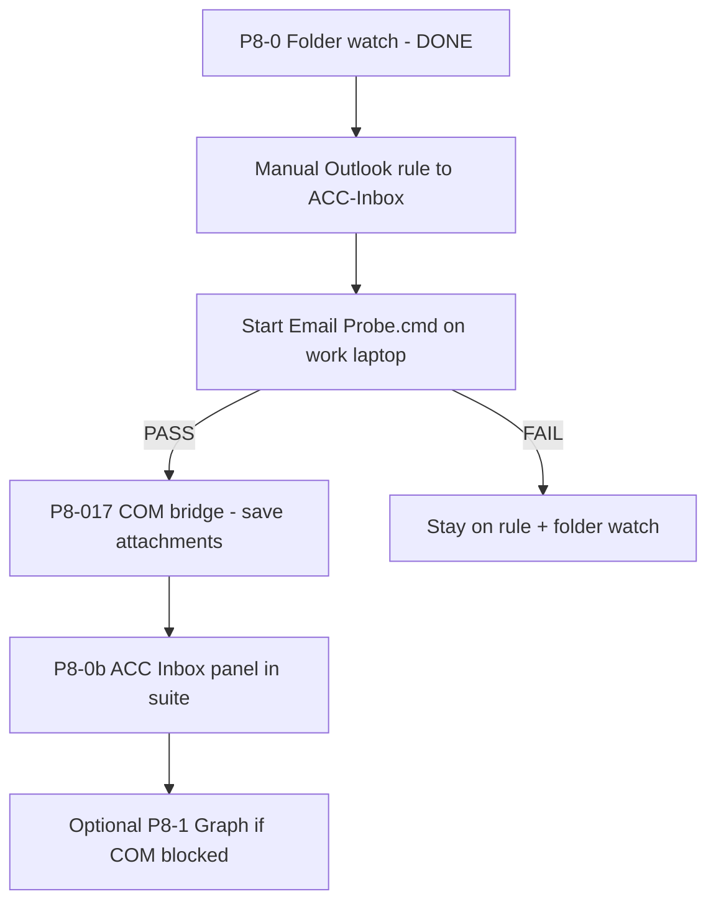

# Outlook Email Automation — Feasibility (Work Laptop)

**Audience:** Prakriti + engineering  
**Date:** 2026-07-08  
**Related:** [`EMAIL_PORTAL_ARCHITECTURE.md`](./EMAIL_PORTAL_ARCHITECTURE.md), [`EMAIL_PORTAL_INPUTS_CHECKLIST.md`](./EMAIL_PORTAL_INPUTS_CHECKLIST.md), [`SIMPLE_PILOT_GUIDE.md`](./SIMPLE_PILOT_GUIDE.md)

---

## Plain-English answer

**Yes — you can likely read Outlook on your work laptop for automation**, as long as IT has not blocked "programmatic access" in Outlook. The best path uses **Outlook COM via PowerShell** (no Node.js), reusing the Outlook session you already have open. **Citrix does not block this** — your ACC letters arrive in **local Outlook desktop**, not inside the Citrix portal. **PHI stays on the laptop** if attachments are saved locally to `ACC-Inbox` and never sent to the cloud.

If COM is blocked, the **manual bridge you have today** (Outlook rule → drop folder → `Start Folder Watch.cmd`) still works with zero IT approval for mailbox APIs.

---

## Verdict table

| Option | Verdict | Why (your setup) |
|--------|---------|------------------|
| **1. Outlook COM (PowerShell)** | **MAYBE → likely CAN** | You use **Outlook desktop** (B-01), already logged in, PowerShell launchers already work (`Start ACC Suite.cmd`, folder watch). COM talks to the **local Outlook process** — no re-login, no Node. **Unknown:** IT "Programmatic Access" policy (checklist B-11). Shared mailbox needs one extra COM call (both mailboxes confirmed B-03). |
| **2. Microsoft Graph / IMAP** | **MAYBE (Graph) / CANNOT (IMAP likely)** | Graph needs **separate OAuth** — does not reuse open Outlook. Hospitals often require **admin consent** for mailbox read. **IMAP** is frequently **disabled** on O365 tenant. MFA/conditional access (B-13) blocks unattended poll unless app registration approved. Use only if COM fails. |
| **3. UI automation (SendKeys / OCR / screenshots)** | **CANNOT as default** | Fragile (DPI, focus, Outlook updates). **PHI on screen captures** — audit and privacy risk. Architecture doc ranks this **last resort only**. Playwright CDP is for **browser portal**, not Outlook desktop. |
| **4. Manual save → ACC-Inbox** | **CAN (today)** | **Shipped:** `Start Folder Watch.cmd` watches `%USERPROFILE%\ACC-Inbox`, writes `.staging` JSON, Review Queue import. Pair with a **manual Outlook rule** (architecture §6c) to move/copy ACC letters. No mailbox API, no IT ticket. |

### Context-specific notes

| Factor | Impact |
|--------|--------|
| **Windows work laptop** | COM requires Windows + Outlook desktop — matches your environment. |
| **Outlook already open** | COM attaches to running `OUTLOOK.EXE`; if closed, probe script starts it or prompts logon. |
| **IT blocks Node, PowerShell OK** | COM bridge is **PowerShell-only** (same as folder watch / portal discover). No `npm` on work PC required. |
| **Citrix** | **Not relevant for email.** Citrix/VPN is for the **hospital portal** (`cl-biprddb02`). ACC letters are in **local Outlook** on the laptop. |
| **PHI must stay local** | COM → save attachment to `ACC-Inbox` → folder watch → HRQ → manual sign-off. No cloud, no screenshot OCR, no LLM. Subjects may contain patient names — ACC Inbox UI should redact if B-14 = Yes. |
| **U-08 policy** | Automation **yes**, **working hours only**, PC **need not stay on overnight** → poll on app open / manual probe, not 02:00 daemon. |

---

## Recommended path ("cherry on top")

1. **Keep using folder watch** — zero risk, already in pilot guide Phase G.
2. **Add Outlook rule** (§6c in architecture doc) — From ACC senders, subject contains `Claim:` + `ACCID:`, copy to a folder you also watch (or save attachments to `ACC-Inbox`).
3. **Run COM probe once** — double-click `Start Email Probe.cmd` on work laptop (see below).
4. **If probe PASS** — engineering ships full `outlook-sync.ps1` (P8-017): filtered read, save `.pdf`/`.docx` to `ACC-Inbox`, folder watch picks up staging.
5. **If probe FAIL** — ask IT about programmatic access (B-11); until then, manual rule + folder watch is the production path.
6. **Graph/IMAP** — only if IT explicitly blocks COM but approves Azure app registration.

---

## COM probe — what to test on work laptop

**Files (after `npm run build`):** `Start Email Probe.cmd`, `outlook-probe.ps1`

**Steps (~2 minutes):**

1. Open **Outlook desktop** and confirm you see ACC mail in the **ACCDistrictNursing** shared mailbox (not only your personal inbox).
2. Double-click **`Start Email Probe.cmd`** from your `dist/` folder.
3. Read the black window:
   - **PASS** — shows `Using mailbox: ACCDistrictNursing`, unread count, last 3 subjects, ACC sender count.
   - **FAIL** — error about programmatic access, Outlook not running, shared mailbox not found, or COM blocked.
4. Check log: `%USERPROFILE%\ACC-Suite\logs\email-probe-bootstrap.log`
5. Override mailbox only if needed: `%USERPROFILE%\ACC-Suite\office-config.json` → `"emailSync": { "sharedMailbox": "OtherName" }`, or set env `ACC_SHARED_MAILBOX` before running.

**What it does NOT do:** read bodies, save attachments, move/delete mail, send mail, or call the network.

**PHI warning:** Subject lines may include patient names. Do not screenshot the probe window for tickets — send the log file only if IT asks.

---

## Start Email Sync.cmd (P8-017 — shipped)

**Default shared mailbox:** `ACCDistrictNursing` (district nursing ACC letters — not personal Default inbox).

**Resolution order:** `%USERPROFILE%\ACC-Suite\office-config.json` → `emailSync.sharedMailbox` → env `ACC_SHARED_MAILBOX` → default `ACCDistrictNursing`.

| Step | Action |
|------|--------|
| 1 | Connect `Outlook.Application` COM (same as probe) |
| 2 | Open **ACCDistrictNursing** inbox via `GetSharedDefaultFolder` (Stores fallback if needed) |
| 3 | Restrict items: ACC allowlist senders, subject patterns, has PDF/DOCX attachment |
| 4 | For each match: save `.pdf`/`.docx` to `%USERPROFILE%\ACC-Inbox\` (checkpoint resume via state file) |
| 5 | Optionally tag **actioned** in Outlook to skip on future runs |
| 6 | Folder watch writes `.staging/*.json` |
| 7 | User imports in **Review Queue** — never auto-commit |

Log line to verify: **`Using mailbox: ACCDistrictNursing`**. Trigger: double-click `Start Email Sync.cmd` or `Start WFH Mode.cmd` during work hours.

---

## IT questions to ask (checklist B-11)

Copy/paste for IT liaison:

> May a local PowerShell script on my DHB laptop use **Outlook COM** (programmatic access) to **read-only** list and save **PDF/Word attachments** from specific ACC senders to a folder under my user profile (`%USERPROFILE%\ACC-Inbox`)? No cloud, no sending mail, no overnight daemon. Working hours only.

If they say no → folder watch + manual Outlook rule remains the approved path.

---

## Bottom line

| Question | Answer |
|----------|--------|
| Can we read Outlook for automation? | **Probably yes** via COM + PowerShell on your work laptop. |
| COM or API or UI? | **COM first** (desktop Outlook open). Graph second. **Not** screenshot/UI for email. |
| Citrix? | **Irrelevant** for email — local Outlook only. |
| PHI local? | **Yes** if attachments stay in `ACC-Inbox` and HRQ sign-off — same as folder watch today. |
| What works without IT? | **Option 4** — manual drop + folder watch. |

*Probe script: `scripts/launcher/outlook-probe.ps1` → copied to `dist/` on build.*
