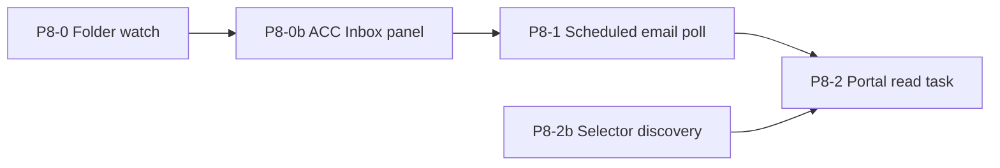
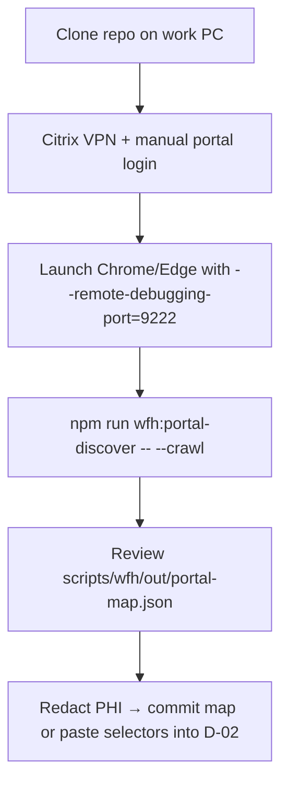

# Email & Hospital Portal — Architecture Assessment

**Audience:** Prakriti + engineering  
**Tone:** Direct — not a sales pitch.  
**Date:** 2026-07-08  
**Related:** [`EMAIL_PORTAL_INPUTS_CHECKLIST.md`](./EMAIL_PORTAL_INPUTS_CHECKLIST.md), [`SUPER_WFH_MODE.md`](./SUPER_WFH_MODE.md), [`MASTER_ROADMAP.md`](./MASTER_ROADMAP.md)

---

## Executive summary

| Idea | Verdict |
|------|---------|
| SSH to email | **Wrong tool** — use IMAP, Graph API, or Outlook COM |
| Remote PC control / screenshots as default | **Bad default** — last resort only; prefer CDP attach to existing browser |
| Full in-suite mail client | **Too ambitious** — don't build Outlook in React |
| Narrow **ACC Inbox** panel | **Genuinely good** — filtered letters + action buttons |
| Outlook COM (Windows, desktop open) | **Best zero re-login path** if IT allows |
| Graph / IMAP OAuth | **Correct** for unattended poll when COM isn't viable |
| Embed webmail iframe | **Likely blocked** by CSP / X-Frame-Options |
| Portal: attach to logged-in browser + recorded selectors | **Correct phased approach** |
| P8-0 folder watch | **Ship now** — no mailbox access needed |

**Recommended phasing:** P8-0 folder watch → P8-0b ACC Inbox → P8-1 scheduled email poll → P8-2 portal automation with selector discovery.

P2–P5 are **not blocked** by P8 email/portal work.

---

## 1. SSH to email — why this is wrong

**SSH (Secure Shell) is for remote shells on servers**, not for reading Microsoft 365 or Exchange mailboxes.

| What people sometimes mean | What to use instead |
|----------------------------|---------------------|
| “SSH into my PC to read mail” | Remote desktop (RDP) — **manual**, not automation; IT often forbids |
| “SSH tunnel to mail server” | **IMAPS** (993) or **Microsoft Graph** HTTPS — proper mail APIs |
| “Run commands on mail server” | You don't control ACC/hospital mail servers; you have **client access only** |

**Correct alternatives (in preference order for your setup):**

1. **Outlook COM automation** (Windows + Outlook desktop running, same user session) — reads inbox without storing passwords in the suite.
2. **Microsoft Graph API** — OAuth once (admin consent may be needed for shared mailbox); best for scheduled poll.
3. **IMAP** — works for some configs; hospital O365 often restricts IMAP or requires app passwords.
4. **Folder watch / manual drop** (P8-0) — no mailbox API; PDF or Word doc already saved or forwarded to disk.

**Do not** pursue SSH as an email integration layer — it will fail IT review and doesn't map to how Exchange/O365 exposes mail.

---

## 2. “Take control of PC” / screenshots — when last resort vs bad default

### Bad default

- **Full remote control** (TeamViewer, unattended RPA with screen coordinates) as the primary integration.
- **Screenshot OCR of Outlook** instead of parsing the PDF attachment.
- **Storing mailbox passwords** in the suite for a headless browser.

Why bad: fragile (resolution, DPI, focus), PHI on screen captures, audit nightmare, breaks when Outlook updates.

### Acceptable last resort

- **Human-in-the-loop** when portal DOM is hostile (canvas, heavy JS, no stable selectors).
- **One-time assisted mapping session**: you log in; dev records selectors; script replays later.
- **Screenshot on failure only** — portal task saves screenshot when selector miss → HRQ `automation-failure`, not for happy path.

### Better default: Playwright CDP attach

If your portal (or Outlook web) is **already open and logged in** in Edge/Chrome:

```
Playwright.connectOverCDP('http://127.0.0.1:9222')
```

- Reuses **existing session** — no password in automation layer.
- Reads DOM, not pixels — faster and more reliable than screenshot RPA.
- Requires launching browser with `--remote-debugging-port=9222` (or IT-approved equivalent).

**Outlook web in browser:** CDP attach works; **Outlook desktop** → prefer COM, not CDP.

---

## 3. In-suite email browser — honest evaluation

### Full mail client clone = too ambitious

Building inbox, folders, threading, search, calendar, and compose in the ACC suite would be **a second product**. Outlook and OWA already exist; you would fight Microsoft feature parity forever.

**Recommendation:** Explicit non-goal. Do not put “email client” on the roadmap.

### Narrow “ACC Inbox” panel = genuinely good

A **filtered panel** inside the suite:

- Query: last N days, sender in allowlist, subject matches ACC patterns, has PDF or Word attachment.
- Each row: date, sender, subject (truncated), attachment name, confidence badge.
- Actions: **Parse → staging**, **Open in letter import**, **Ignore**, **Mark duplicate**.

This matches how you actually work — you don't browse all mail; you **process ACC letters**.

| Pros | Cons |
|------|------|
| Stays in workflow context | Still needs a mail API or COM bridge |
| No reimplementation of mail UI | Filter rules need tuning (checklist B-04–B-07) |
| Feeds HRQ staging, never auto-commit | IT policy may block API access |

**Verdict:** Build **ACC Inbox**, not “Email module”. Phase **P8-0b**.

### Outlook already open → COM automation (Windows)

If B-01 = Outlook desktop and IT allows COM:

- Node script via `winax` or PowerShell calling Outlook COM can enumerate filtered items and save attachments to `ACC-Inbox/`.
- **Zero re-login** — uses your existing Outlook session.
- Works during **working hours** (matches U-08 — no overnight PC required if you trigger poll on app open).

**Verdict:** Preferred path for P8-0b on hospital Windows PCs **if** IT approves COM automation.

### Graph API / IMAP vs iframe

| Approach | Re-login | Unattended | Hospital friction |
|----------|----------|------------|-------------------|
| Graph OAuth | Once (+ refresh token) | Yes | Admin consent for shared mailbox |
| IMAP | App password / OAuth | Yes | Often disabled |
| Embed OWA iframe | N/A | N/A | **Blocked** by X-Frame-Options / CSP |

**Verdict:** Graph or IMAP for scheduled poll (P8-1). **Do not plan** on embedding webmail iframe.

---

## 4. Hospital portal — logged-in session scraping

**Goal:** Read PO status, claim fields, remittance list — **without logging in again each run**.

### Recommended stack

1. **Playwright attach to existing browser** (CDP) — session reuse.
2. **Recorded selectors** per portal page — stored in config, not hardcoded in code.
3. **Selector discovery script** (`scripts/wfh/portal-discover.mjs`, P8-2b) — human navigates once; tool captures stable CSS/data attributes.
4. **Human-in-the-loop first mapping** — you provide screenshots + field list (checklist Section D).
5. **Break detection** — selector miss → HRQ failure item, not silent wrong data (P8-011).

### UI scraping on local network

Acceptable when:

- Traffic stays **on-prem / VPN**; no PHI sent to cloud LLM.
- Read-only tasks first (status check); **no auto-submit** without HRQ sign-off.
- IT confirms automation policy (checklist D-10–D-12).

### What not to do first

- Full portal rewrite inside the suite.
- Computer-vision-only RPA without DOM access.
- Storing portal password in plaintext config.

**ACC District Nursing Visits — letter cross-check match key (2026-07-08):** User confirmed primary columns for daily letter cross-check: **Patient Name**, **ACCNumber**, **NHI**; secondary: **Service Item Code** (often derivable from ACC number). Portal scrape rows should join to letter-import staging on **NHI + claim number + name**; service code disambiguates when one patient has multiple NS rows. See [`portal-samples/REPORT_COLUMNS_2026-07-08.md`](portal-samples/REPORT_COLUMNS_2026-07-08.md).

---

## 5. Phased approach (aligned with MASTER_ROADMAP)



| Phase | Delivers | Needs from you |
|-------|----------|----------------|
| **P8-0** | Drop PDF/Word → `.staging/` JSON → HRQ staging | Inbox folder path; test PDF + .docx |
| **P8-0b** | ACC Inbox panel + COM or Graph read | B-01–B-11 checklist |
| **P8-1** | Scheduled poll during work hours | Graph/IMAP credentials policy |
| **P8-2** | One portal read task → HRQ | D-01–D-12, screenshots |
| **P8-2b** | Selector discovery tooling | 1h mapping session on work PC |

**Dependency rule:** P8-0 does **not** require P2–P5 complete for dev testing, but production SUPER WFH still waits on P0–P5 gates per roadmap §4.

---

## 6. Architecture diagram — data flow

```
[Outlook / Graph / IMAP / Folder drop]
           │
           ▼
   [Ingress scripts — Node, local PC]
           │
           ▼
   [Staging store / .staging JSON]  ──never──► live AppData
           │
           ▼
   [HRQ / ACC Inbox panel — sign-off]
           │
           ▼
   [letterImport.ts parse → confirm modal]
           │
           ▼
   [Live AppData + audit log]
```

Portal read tasks follow the same path — results land in staging, not direct merge.

---

## 6b. Word document (.doc/.docx) attachment support (P8 requirement)

**User input (2026-07-08):** ACC letters often arrive as **Word attachments**, not only PDF. Formats seen to date: **Word + PDF only** — a feasible, bounded scope.

### Pipeline (same as PDF after text extraction)

```
[.doc/.docx attachment]
        │
        ▼
[extract plain text]  ← mammoth.js (.docx) or LibreOffice/Word COM convert-to-text (.doc legacy)
        │
        ▼
[parseLetterFromText() / parseApprovalLetter()]  ← existing deterministic parsers in letterImport.ts
        │
        ▼
[HRQ staging → confirm modal → live AppData]
```

| Format | Extraction approach | Notes |
|--------|---------------------|-------|
| `.docx` | **mammoth.js** (Node, offline) | Preferred — no Word install required; extracts raw text |
| `.doc` (legacy) | Word COM `SaveAs` plain text, or LibreOffice headless | Only on work PC where Word is installed; fallback: manual save-as-.docx |
| `.pdf` | Existing `extractPdfText()` | Already implemented |

**Non-goals:** Excel, images, RTF-only letters, or LLM parsing.

**Engineering tasks:** Extend `folder-watch.mjs` and Outlook COM bridge to accept `.doc`/`.docx`; add `extractWordText()` in `letterImport.ts`; unit tests with fixture `.docx` files. See **P8-020** in `MASTER_ROADMAP.md`.

**Portal note:** Internal URL `http://cl-biprddb02/...` is reachable only on hospital network or Citrix VPN. Automation runs on the **work PC**, not from Cursor cloud agents. Do **not** automate Citrix VPN login with stored passwords — manual VPN + manual portal SSO per session, then CDP attach.

**P8-020 Word parser priority (2026-07-08 corpus):** User confirms ACC letters are **often Word**, but the first corpus `.eml` contained **PDF + PNG only** (process doc + portal screenshots). Word parser (`extractWordText()` / mammoth.js) remains **high priority** for P8-020 — do not defer because this sample lacked `.doc/.docx`.

**P8-020 Word fixture (2026-07-08):** `approval-template.docx` added to `src/lib/fixtures/` and `scripts/stress/fixtures/email/`. `extractWordText()` uses **mammoth.js**; `classifyLetter()` + `parseApprovalLetter()` produce the same claim/PO/NHI/service rows as the PDF template in unit tests. Template uses ACC sample names (George Bellingham) — not real PHI.

---

## 6d. Portal probe workflow (P8-2b — work laptop only)

Internal portal URL (`http://cl-biprddb02/...`) is **not reachable** from Cursor cloud or home dev machines without Citrix VPN. Full blind scrape without login is **not possible** from here.

### What we have without VPN

| Asset | Use |
|-------|-----|
| 3 email PNGs | Nav path: portal tiles → Health & BI Reports → ACC → DHB-wide/ACC report list |
| `portal-discover.mjs` | CDP attach script for **your** logged-in browser on work PC |
| `scripts/wfh/README.md` | Step-by-step: VPN → manual login → `--remote-debugging-port=9222` → run script |

### Recommended workflow (work laptop)



1. **Clone** repo on work laptop; `npm install` (pulls `playwright` devDependency).
2. **Manual** Citrix VPN + SSO — never automate VPN/password in scripts.
3. **Launch** browser with remote debugging; open portal to Browse → DHB-wide → ACC (or deeper).
4. **Run** `npm run wfh:portal-discover` (add `-- --crawl` to follow ACC / District Nursing links).
5. **Commit** redacted `portal-map.json` or transfer selectors to engineering — **no credentials in JSON**.

### Screenshot gaps (still need from you)

- Login page (D-07) — for break-detection only; CDP attach skips re-login.
- Opened report: parameters + result grid with fields you look up (D-09).
- D-02 table: ~~which columns map to PO status, claim number, etc.~~ **Recorded 2026-07-08** — primary: NHI, Patient Name, ACCNumber; secondary: Service Item Code.

The 3 screenshots are **enough to start** mapper scaffolding; they are **not enough** to finish field-level scrape without probe output or D-09.

---

## 6c. Proposed Outlook / ACC Inbox filter rules (2026-07-08)

From email corpus sample + checklist B-04–B-07. **One rule for both approvals and declines** — sender and subject patterns are shared; letter type is **not** encoded in the email subject.

### Outlook rule (manual setup on work PC)

| Condition | Value |
|-----------|-------|
| **From** | `Bec.Williams@acc.co.nz` OR `John.Bentley@acc.co.nz` OR `Becky.Tunnell@acc.co.nz` |
| **Subject contains** | `Claim:` **and** `ACCID:` |
| **Has attachment** | Yes (PDF and/or Word) |
| **Action** | Move/copy to `ACC/Inbox` (path TBD — checklist B-09) |

**No separate decline rule.** B-05/B-07 confirmed 2026-07-08: decline senders and subject format match approvals exactly.

### Programmatic filter (ACC Inbox panel / COM / Graph query)

```
FROM IN (
  'Bec.Williams@acc.co.nz',
  'John.Bentley@acc.co.nz',
  'Becky.Tunnell@acc.co.nz'
)
AND subject CONTAINS 'Claim:'
AND subject CONTAINS 'ACCID:'
AND hasAttachments = true
```

Optional: restrict attachment extension to `.pdf`, `.doc`, `.docx` after P8-020 ships.

### Post-fetch classification (approval vs decline)

After ingress saves the attachment, **`classifyLetter()`** in `letterImport.ts` determines letter type from **parsed attachment text**, not from the email subject:

| Signal | Letter kind |
|--------|-------------|
| `NUR02`, `APPROVAL FOR NURSING SERVICES` | approval |
| `NUR04VEN`, `DECLINE OF NURSING SERVICES`, "unable to approve" | decline |

ACC Inbox rows should show the classified kind (badge) after parse; routing to Approvals vs Declines staging follows this result. Subject-line claim/ACCID regex below is for **matching and display**, not approval/decline routing.

### Subject-line extraction regex

Use on normalized subject string (collapse whitespace):

| Field | Regex | Example match |
|-------|-------|---------------|
| Claim number | `Claim:(\d+)` | `Claim:10000003194` → `10000003194` |
| ACC vendor ID | `ACCID:([A-Z0-9-]+)` | `ACCID:VEND-K96655` → `VEND-K96655` |

**Sample subject (fake data):** `Mr Gilbert Gandor - Claim:10000003194 ACCID:VEND-K96655`

**PHI note:** Patient name appears **before** the claim token in observed pattern. ACC Inbox UI should truncate/redact subject in list views if B-14 = Yes; use claim number + ACCID for matching, not display name.

### Corpus sample structure (reference)

Parsed from `emailwithstuffinit.eml` (2026-07-08) — self-forwarded **notes** email, not a live ACC letter:

| Header | Value |
|--------|-------|
| From / To | User mailbox *(redacted in fixtures)* |
| Subject | *(empty in original)* |
| Date | Wed, 08 Jul 2026 07:54:19 +1200 |
| Body | Lists approval senders + fake subject pattern; parse hints for filter tuning |
| Attachments | 3× PNG (portal nav screenshots), 1× PDF (`Nursing services processes.pdf`, internal process doc) |

Fixtures: `scripts/stress/fixtures/email/` (`acc-approval-sample.eml`, `email-corpus-notes.eml`, PNGs, PDF).

---

## 8. Decisions already captured (U-08)

From `USER_INPUTS_NEEDED.md`:

- Email automation: **yes**, programmatic, **working hours only**.
- PC **need not stay on overnight** → favours **poll on app open** + folder watch, not 02:00 daemon (orchestrator P8-3 deferred).

Architecture respects this: COM/Graph poll when you start the suite; folder watch while you're logged in.

---

## 9. Bottom line

- **Don't build a mail client.** Build **ACC Inbox** + ingress scripts.
- **Don't SSH to email.** Use **COM / Graph / IMAP / folder watch**.
- **Don't default to screen control.** Use **CDP attach + DOM selectors**; screenshots only on failure.
- **Folder watch (P8-0) is shippable today** and unblocks letter workflow before IT approves mailbox API.
- **Portal automation is viable** but requires your checklist inputs and a one-time mapping session — plan for breakage when the hospital updates the portal UI.
