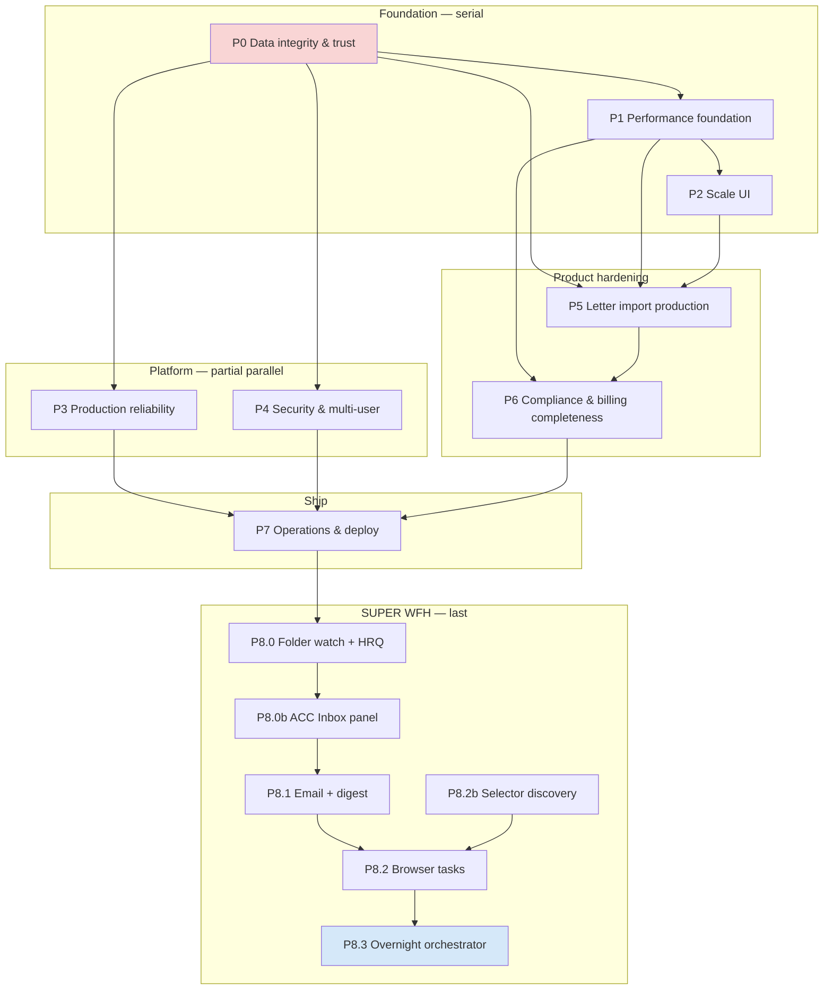

# MASTER ROADMAP — ACC Admin Suite (Production + SUPER WFH)

**Status:** Engineering wrap-up 2026-07-08 — see `WRAP_UP_STATUS.md` for done/blocked split.  
**Audience:** Engineering, product, hospital UAT, parent orchestration agents.  
**Sources merged:** `OPTIMIZATION_PLAN.md`, `PRODUCTION_READINESS.md`, `SUPER_WFH_MODE.md`, `STRESS_TEST_REPORT.md`, `STRESS_TEST_AND_LOOPING.md`, `LETTER_IMPORT_UX.md`, `holistic_ux_remediation_a4e78f3c.plan.md`, `acc_letter_import_21ebe7fd.plan.md`, codebase wiring (`App.tsx`, `store.ts`, `Sidebar.tsx`, `Dashboard.tsx`, letter import flow), graphify subgraphs for store/compliance/import/routing.

**Companion:** `USER_INPUTS_NEEDED.md` — hospital inputs with blocking vs default.

---

## 0. Executive summary & principles

### Vision

Deliver **fully production-ready** offline-first ACC district-nursing admin software for daily hospital use (2,000+ patients, 12,000+ invoice lines), then evolve to **SUPER WFH mode** (overnight ingress → human review queue → morning sign-off) only after trust, performance, and letter-import correctness gates pass.

### Definition of Done — "production ready"

A phase or release is production-ready when **all** of the following hold:

1. **Data trust** — No silent data loss paths; corrupt load shows recovery UI; backups are prompted and verifiable; save model is unambiguous in UI.
2. **Correctness** — `npm test` ≥ 54 tests (baseline grows with new suites) all pass; letter import journeys covered by unit + integration tests; compliance rules unchanged unless explicitly versioned.
3. **Scale** — `npm run stress:large` all 22 benchmarks pass at **<50% of threshold** (post-P1 target); dashboard interactive **<2 s** on reference hardware at 2k patients; Billing/Compliance tables scroll at 60 fps via virtualization.
4. **UX contract** — Every async flow implements Loading → Confirm/Edit → Success → Error; `LETTER_IMPORT_UX.md` routing matrix verified; no duplicate hidden file inputs; post-commit navigation + flash feedback wired.
5. **Operations** — CI runs unit + stress; version visible in UI; runbooks for IDB wipe, restore, passphrase loss; global error boundary exports diagnosable error file.
6. **Security baseline** — Encryption policy applied; idle lock; auto-commit **disabled**; audit stub for mutations (expand in P4).
7. **UAT** — Named hospital admins sign off on 20 manual journeys (§4) with zero P0 regressions from risk register (§6).

### Non-goals (explicit)

| Non-goal | Rationale |
|----------|-----------|
| Full EMR integration | Out of scope; local ACC admin tool |
| Cloud PHI sync / multi-tenant SaaS | Conflicts with offline-first; defer unless U-07 chooses server path |
| LLM letter parsing | Offline, deterministic parsers only |
| Legal/licensing sign-off | Functional readiness only per PRODUCTION_READINESS |
| Rewriting compliance rule semantics | Wrap with incremental scan; don't change rule meaning without policy doc |
| Global toast library | Use existing `useFlash` / TopBar pattern |
| Silent auto-merge duplicate approvals | User must confirm |
| MVP shortcuts | This roadmap is full production path, not MVP |

### Dependency order (must NOT parallelize)

```
P0 Data integrity ──► P1 Performance ──► P2 Scale UI
        │                      │                  │
        └──────────► P5 Letter import hardening ◄─┘
                              │
        P3 Production reliability (CI, backup, migrations) ── parallel after P0, merges before P7
        P4 Security & multi-user decision ── after P0, blocks P8 sign-off identity
        P6 Compliance & billing completeness ── after P1 (needs perf) + P5 (import stable)
        P7 Operations & deploy ── after P3 + P6
        P8 SUPER WFH Phase 0–3 ── ONLY after P0–P5 quality gates pass (SUPER_WFH_MODE §G)
```

**Hard rules:**

- Do **not** start P8 until P0–P5 gates in §4 are green.
- Do **not** enable email/browser automation until P5 letter corpus (U-05) and audit log (P3/P4) exist.
- Do **not** virtualize tables (P2) before compliance cache (P1-001) — otherwise UI masks CPU waste.
- Do **not** ship auto-commit in production config (P0-005) regardless of dev convenience.

### Architecture anchors (verified wiring)

| Concern | Primary files | Notes |
|---------|---------------|-------|
| Module shell | `App.tsx`, `Sidebar.tsx` | 12 `ModuleId` routes; `focus` switches module |
| State / autosave | `store.ts`, `idb.ts`, `storage.ts` | `mutate()` → debounced IDB; `dirty` ≠ autosaved |
| Badges / triple compliance | `App.tsx:128–158` | `buildActionQueue` + `runCompliance` on every `data` change |
| Dashboard queue | `Dashboard.tsx:57–58` | Duplicate `buildActionQueue` + `runCompliance` |
| Letter import | `letterImport.ts`, `LetterImportModal.tsx`, `LetterImportButton.tsx` | `autoCommit` gated by `productionMode` (default off) |
| Compliance fixes | `Compliance.tsx:57–85` | `create-approval` → Approvals focus (fixed); no dedicated import button on Compliance page |
| Corrupt load | `store.ts` `init()` via `recovery.ts` | Recovery modal — no silent `sampleData()` |

---

## 1. User inputs required

See **`USER_INPUTS_NEEDED.md`** for the full table. Summary:

**Top 5 blocking inputs:**

1. **U-01** Deployment target
2. **U-05** Anonymised real letter corpus (10–30 PDFs)
3. **U-06** Volume baselines
4. **U-07** Multi-user architecture decision
5. **U-08** SUPER WFH automation policy (email/overnight/PHI)

Mark each response **blocking** vs **can default** in that file.

---

## 2. Phase map



---

## 3. Phases with concrete checklists

> **Task template** (every item follows this shape):  
> `- [ ] **TASK-ID: Title**` with Module/route, Depends on, Acceptance criteria, Tests, Optimization tie-in, Routing verification, Rollback.

---

### P0 — Data integrity & trust

**Gate purpose:** Eliminate silent data loss and unsafe auto-commit before any hospital pilot.

- [x] **P0-001: Corrupt IDB recovery UI**
  - Module/route: `store.ts` `init()`, new `RecoveryModal.tsx`, `App.tsx`
  - Depends on: —
  - Acceptance criteria:
    - Deserialize failure never calls `sampleData()` silently
    - User sees: last backup path hint, "Restore from ZIP", "Restore from .accdata", "Start empty", "Load sample (dev only)" behind explicit confirm
    - Choice persisted so repeat opens don't loop
  - Tests: unit test mock corrupt JSON → recovery state; manual journey **J-16**
  - Optimization tie-in: —
  - Routing verification: App load from corrupt IDB → recovery modal blocks main UI
  - Rollback: feature flag `ALLOW_SAMPLE_FALLBACK` default false; revert commit

- [x] **P0-002: Corrupt file load (.accdata / ZIP)**
  - Module/route: `storage.ts`, `store.ts` `loadMyData`, `ExportCenter.tsx` `importFullBackup`
  - Depends on: P0-001
  - Acceptance criteria: parse errors show TopBar flash + modal; no partial apply without confirm
  - Tests: unit corrupt JSON; manual **J-17**
  - Optimization tie-in: —
  - Routing verification: TopBar Load → corrupt file → error, data unchanged
  - Rollback: revert error handling only

- [x] **P0-003: Save model clarity (complete)**
  - Module/route: `TopBar.tsx`, `SettingsModule.tsx`, `store.ts` status
  - Depends on: —
  - Acceptance criteria:
    - Three states visible: "Auto-saved locally (IndexedDB)", "Exported to .accdata {time}", "Unsaved changes — export recommended"
    - First-run tooltip or Settings blurb explains IDB vs file
    - `dirty` semantics documented in UI (IDB autosave does NOT clear dirty)
  - Tests: manual **J-03**, **J-04**; optional store unit for dirty transitions
  - Optimization tie-in: —
  - Routing verification: edit patient → dirty banner; Save my data → cleared
  - Rollback: revert TopBar copy

- [x] **P0-004: Scheduled backup reminder**
  - Module/route: `App.tsx`, `store.ts` `status.lastExportAt`, modal component
  - Depends on: P0-003, U-14
  - Acceptance criteria: if `lastExportAt` older than 7 days (configurable), weekly modal with Export Center link; snooze 24h
  - Tests: manual **J-05** with mocked date
  - Optimization tie-in: —
  - Routing verification: Settings shows last export date
  - Rollback: disable via settings flag

- [x] **P0-005: Disable production auto-commit**
  - Module/route: `letterImport.ts` `parseLetterFromText`, `LetterImportModal.tsx`, `settings` or build-time flag
  - Depends on: —
  - Acceptance criteria:
    - `autoCommit` always false when `settings.productionMode !== false` (default true)
    - 100% confidence letters still show confirm; user must click Save
    - Dev mode can re-enable in Settings for fixture testing only
  - Tests: `letterImport.test.ts` assert autoCommit false in production config; manual **J-06**
  - Optimization tie-in: —
  - Routing verification: George fixture + matched patient → confirm screen, not silent file
  - Rollback: settings toggle

- [x] **P0-006: Audit log stub (append-only)**
  - Module/route: `store.ts` `mutate()`, new `src/lib/auditLog.ts`, IDB key `audit.jsonl`
  - Depends on: —
  - Acceptance criteria: each `mutate` appends `{ ts, action, entityType, entityId, summary }`; capped at 10k lines with rotation; view in Settings (read-only)
  - Tests: unit append on addPatient, deleteClaim
  - Optimization tie-in: trim from autosave payload later (P1-009)
  - Routing verification: Settings → Recent activity shows last 50 events
  - Rollback: stop writing; delete IDB key

- [x] **P0-007: Integrity validation on load**
  - Module/route: `storage.ts` `normalizeData`, new `validateReferentialIntegrity()`
  - Depends on: P0-001
  - Acceptance criteria: orphan claims/lines reported in recovery or Settings health panel; load proceeds with warnings list
  - Tests: unit fixture with dangling claimId
  - Optimization tie-in: —
  - Routing verification: load valid data → no warnings
  - Rollback: warnings-only mode

- [x] **P0-008: Document blob orphan repair**
  - Module/route: `store.ts` `removeDocument`, `idb.ts`, ExportCenter verify
  - Depends on: P0-007
  - Acceptance criteria: failed blob delete surfaces error; backup manifest lists blob count vs metadata count
  - Tests: manual backup round-trip **J-18**
  - Optimization tie-in: —
  - Routing verification: delete document → blob gone from IDB
  - Rollback: revert delete handler

- [x] **P0-009: beforeunload + dirty alignment**
  - Module/route: `App.tsx`, `TopBar.tsx`
  - Depends on: P0-003
  - Acceptance criteria: browser prompt only when dirty; in-app nav never prompts
  - Tests: manual **J-03**
  - Optimization tie-in: —
  - Routing verification: edit → close tab → prompt; navigate modules → no prompt
  - Rollback: —

- [x] **P0-010: Holistic Phase 0 — journey contract frozen**
  - Module/route: `change-requests/LETTER_IMPORT_UX.md`
  - Depends on: —
  - Acceptance criteria: entry point table matches code; updated on any routing change; linked from Settings
  - Tests: doc review checklist
  - Optimization tie-in: —
  - Routing verification: all entry points in §5 matrix documented
  - Rollback: —

---

### P1 — Performance foundation

**Gate purpose:** Remove redundant compliance scans and approach <50% stress thresholds.

- [x] **P1-001: Single compliance cache per tick**
  - Module/route: new `src/lib/complianceCache.ts` or store selector; `Dashboard.tsx`, `App.tsx`, `Compliance.tsx`, `Patients.tsx`, `analytics.ts`
  - Depends on: P0 complete
  - Acceptance criteria: `runCompliance(data)` at most once per `data` reference change per render frame; shared getter `getComplianceFindings(data)`
  - Tests: stress `runCompliance` unchanged; profile note in report; unit mock call counter
  - Optimization tie-in: OPT-0.1 — **−200–400 ms** dashboard
  - Routing verification: edit claim → sidebar badge + dashboard update without 3× CPU spike
  - Rollback: remove cache, direct calls

- [x] **P1-002: Cached findings in buildActionQueue**
  - Module/route: `analytics.ts` `buildActionQueue(data, findings?)`
  - Depends on: P1-001
  - Acceptance criteria: no `runCompliance` inside `buildActionQueue` when findings passed; `App.tsx` badges pass cache
  - Tests: stress `buildActionQueue` **<1.2 s** (target <50% = 1.25s)
  - Optimization tie-in: OPT-0.2
  - Routing verification: Dashboard action count matches Compliance violation count
  - Rollback: optional findings param defaults to internal call

- [x] **P1-003: Pre-index maps in analytics hot paths**
  - Module/route: `analytics.ts` `coverageGapClaims`, `buildActionQueue` invoice loops
  - Depends on: —
  - Acceptance criteria: `coverageGapClaims` **<400 ms** at large scale; single-pass indexes per call
  - Tests: stress benchmark; unit index correctness
  - Optimization tie-in: OPT-0.4 — 93% → <30% threshold
  - Routing verification: Dashboard coverage gap items still correct vs baseline snapshot
  - Rollback: revert to linear search

- [x] **P1-004: Lightweight sidebar badges**
  - Module/route: `App.tsx:128–158`
  - Depends on: P1-001, P1-002
  - Acceptance criteria: sidebar does NOT call full `buildActionQueue`; uses cheap counters + cached compliance summary
  - Tests: stress or perf counter; manual sidebar refresh after edit
  - Optimization tie-in: OPT-0.5
  - Routing verification: badge numbers match module-specific filters
  - Rollback: restore full queue for badges

- [x] **P1-005: Cap action queue for display**
  - Module/route: `Dashboard.tsx`, `analytics.ts` return type
  - Depends on: P1-002
  - Acceptance criteria: full count in badge; render top 50 by severity + "View all in Compliance/Billing" links; total count shown
  - Tests: stress still builds full array (engine); UI test or manual **J-07**
  - Optimization tie-in: OPT-0.3 — DOM −90%
  - Routing verification: Dashboard shows ≤50 rows; link opens Compliance filtered
  - Rollback: raise cap constant

- [x] **P1-006: Debounce autosave for bulk edits**
  - Module/route: `store.ts` `scheduleSave`, `excelImport.ts`, letter commit batch
  - Depends on: —
  - Acceptance criteria: `pauseAutosave()` during Excel import; 3–5 s debounce; resume flushes once
  - Tests: stress serialize count; manual large import
  - Optimization tie-in: OPT-0.6
  - Routing verification: import 500 rows → single save at end
  - Rollback: restore 1s debounce

- [x] **P1-007: Compliance page paginate groups**
  - Module/route: `Compliance.tsx`
  - Depends on: P1-001
  - Acceptance criteria: first 50 patient/claim groups; "Load more" or pagination; filter still scans full cached findings
  - Tests: manual **J-08** with large fixture
  - Optimization tie-in: OPT-0.7
  - Routing verification: Compliance filter → paginated groups
  - Rollback: show all with warning in settings

- [x] **P1-008: Memoize dashboardMetrics**
  - Module/route: `analytics.ts`, `Dashboard.tsx`
  - Depends on: P1-003
  - Acceptance criteria: `dashboardMetrics` **<800 ms** at large scale; shares indexes with action queue
  - Tests: stress benchmark
  - Optimization tie-in: OPT-1.7
  - Routing verification: Dashboard stat cards match Export Center totals
  - Rollback: —

- [x] **P1-009: Trim autosave payload — importHistory split**
  - Module/route: `store.ts`, `idb.ts`
  - Depends on: P0-006
  - Acceptance criteria: `importHistory` in separate IDB key; serialize size **−20%** (target ~7 MB at 2k)
  - Tests: stress `serialize` timing + size note
  - Optimization tie-in: OPT-1.6
  - Routing verification: Settings recent imports still loads
  - Rollback: inline history again

- [x] **P1-010: Patient detail claim-scoped findings**
  - Module/route: `Patients.tsx:318`
  - Depends on: P1-001
  - Acceptance criteria: filter cached findings by patientId; no full `runCompliance` in detail pane
  - Tests: unit filter; manual patient detail
  - Optimization tie-in: OPT-1.8
  - Routing verification: patient detail flags match Compliance page for that patient
  - Rollback: —

- [x] **P1-011: Derived-index layer in store (incremental)**
  - Module/route: `store.ts` `mutate()`, new `src/lib/indexes.ts`
  - Depends on: P1-003
  - Acceptance criteria: `linesByClaimId`, `approvalsByClaimId`, `patientsById` maintained on CRUD; analytics consumes
  - Tests: unit CRUD + index consistency; stress medium regression
  - Optimization tie-in: OPT-1.1
  - Routing verification: —
  - Rollback: rebuild indexes on read

- [x] **P1-012: Incremental compliance (dirty claims)**
  - Module/route: `compliance.ts`, `store.ts`, `complianceCache.ts`
  - Depends on: P1-001, P1-011
  - Acceptance criteria: single-claim edit re-runs rules for affected claims only; full scan on load; merge findings
  - Tests: compliance.test.ts incremental cases; stress single-edit simulation
  - Optimization tie-in: OPT-1.2 — **−70–90%** typical edit
  - Routing verification: edit one claim → only that claim findings update within 100 ms
  - Rollback: full scan flag

- [x] **P1-013: Persist compliance snapshot in IDB**
  - Module/route: `idb.ts`, `store.ts` init
  - Depends on: P1-001, P1-012
  - Acceptance criteria: cold start dashboard uses snapshot until first edit; invalidate on data hash mismatch
  - Tests: stress deserialize + first paint timing; manual cold load
  - Optimization tie-in: OPT-1.5
  - Routing verification: reload browser → dashboard <500 ms findings display
  - Rollback: skip snapshot read

- [x] **P1-014: Split action queue by kind (lazy billing)**
  - Module/route: `analytics.ts`, `Dashboard.tsx`
  - Depends on: P1-002
  - Acceptance criteria: billing actions computed when billing tab expanded or link clicked
  - Tests: stress `buildActionQueue` with billing deferred path
  - Optimization tie-in: OPT-1.4
  - Routing verification: Dashboard default tab fast; billing items still reachable
  - Rollback: eager build

- [x] **P1-015: Stress CI gate**
  - Module/route: `.github/workflows/ci.yml`, `scripts/stress/run-stress.mjs`, `report.json` baseline
  - Depends on: P1-002, P1-003
  - Acceptance criteria: CI runs `npm test` + `npm run stress:medium`; fails on threshold breach; committed baseline
  - Tests: CI itself
  - Optimization tie-in: OPT-1.10, STRESS_TEST_AND_LOOPING §2
  - Routing verification: —
  - Rollback: stress job optional manual

- [x] **P1-016: Stress regression baseline (20% guard)**
  - Module/route: `scripts/stress/stress.test.ts`
  - Depends on: P1-015
  - Acceptance criteria: fail if any benchmark regresses >20% vs committed `report.json` without explicit bump PR
  - Tests: deliberate regression test in CI
  - Optimization tie-in: STRESS_TEST_AND_LOOPING §2.6
  - Routing verification: —
  - Rollback: disable regression check

---

### P2 — Scale UI

**Gate purpose:** Unbounded DOM tables and layout cliffs removed.

- [x] **P2-001: Virtualize DataTable — Billing**
  - Module/route: `DataTable.tsx`, `Billing.tsx`
  - Depends on: P1 complete
  - Acceptance criteria: 12k rows render ~30 DOM rows; scroll 60 fps on U-18 hardware
  - Tests: Playwright or manual **J-09**; optional perf script
  - Optimization tie-in: OPT-1.3
  - Routing verification: Billing sort/filter works on virtualized list
  - Rollback: feature flag `virtualizeBilling`
  - **Delivered 2026-07-08:** `@tanstack/react-virtual` windowing in `DataTable.tsx` (threshold 50 rows)

- [x] **P2-002: Virtualize DataTable — Compliance findings list** *(superseded by P1-007)*
  - Module/route: `Compliance.tsx` (grouped cards, not DataTable)
  - Depends on: P1-007
  - Acceptance criteria: 6k+ findings grouped view scrollable without jank
  - **Note:** P1-007 group cap + load-more satisfies this; no DataTable in Compliance module

- [x] **P2-003: Virtualize DataTable — Approvals**
  - Module/route: `Approvals.tsx`
  - Depends on: P2-001 pattern
  - Acceptance criteria: 1k+ approvals smooth scroll; historical toggle still works
  - Tests: manual **J-10**
  - Optimization tie-in: Past incident — unbounded Approvals tables
  - Routing verification: "Show historical" loads archived rows
  - Rollback: —
  - **Delivered 2026-07-08:** shared virtualized `DataTable`

- [x] **P2-004: Virtualize DataTable — Declines**
  - Module/route: `Declines.tsx`
  - Depends on: P2-001 pattern
  - Acceptance criteria: 300+ declines no layout freeze; sort by date works
  - Tests: manual **J-11**
  - Optimization tie-in: Past incident — unbounded Declines
  - Routing verification: Open patient link works per row
  - Rollback: —
  - **Delivered 2026-07-08:** shared virtualized `DataTable`

- [ ] **P2-005: Virtualize patient list (if needed)** — BLOCKED: U-06 volume — no jank at 2k; skip until hospital reports >5k patient jank BLOCKED: U-06 volume — no jank at 2k; skip until hospital reports >5k patient jank Virtualize patient list (if needed)**
  - Module/route: `Patients.tsx`
  - Depends on: U-06 volume
  - Acceptance criteria: only if >5k patients on reference hardware shows jank; else skip with sign-off
  - Tests: stress patients benchmarks (already <1 ms — likely skip)
  - Optimization tie-in: STRESS_TEST_REPORT P2 Patients UI
  - Routing verification: search + pagination
  - Rollback: —
  - **Deferred 2026-07-08:** stress benchmarks <1 ms at 2k — skip until U-06 shows jank

- [x] **P2-006: Modal layout / grid alignment**
  - Module/route: `Modal.tsx`, `LetterImportModal.tsx`, `index.css`
  - Depends on: —
  - Acceptance criteria: confirm modal not clipped at 1280×720 and mobile; grid columns align; no overflow hidden on footer buttons
  - Tests: manual **J-12**; visual regression optional
  - Optimization tie-in: Past incident — modal clipped, grid misalignment
  - Routing verification: open letter confirm → all buttons visible
  - Rollback: revert CSS

- [x] **P2-007: Mobile layout — sidebar + Patients grid**
  - Module/route: `Sidebar.tsx`, `Patients.tsx`, `LetterImportModal.tsx`
  - Depends on: P2-006
  - Acceptance criteria: collapsible sidebar (exists); Patients grid stacks; full-width confirm on `<lg`
  - Tests: manual **J-13** at 375px width
  - Optimization tie-in: Holistic #22
  - Routing verification: hamburger menu navigates all modules
  - Rollback: —

- [ ] **P2-008: Letter import Web Worker OCR** — BLOCKED: P5-001 corpus + OCR worker scope — defer Web Worker OCR BLOCKED: P5-001 corpus + OCR worker scope — defer Web Worker OCR Letter import Web Worker OCR**
  - Module/route: `letterImport.ts`, new worker bundle, `vite.config.ts`
  - Depends on: P5-001 corpus available
  - Acceptance criteria: OCR runs off main thread; progress events on main; CSP still passes verify-build
  - Tests: manual scanned PDF **J-14**; stress optional
  - Optimization tie-in: OPT-1.9
  - Routing verification: import scanned letter → UI responsive during OCR
  - Rollback: main-thread OCR fallback

---

### P3 — Production reliability

- [x] **P3-001: Global error boundary**
  - Module/route: new `ErrorBoundary.tsx`, `App.tsx`
  - Depends on: P0-001
  - Acceptance criteria: React errors show recovery screen with "Download error report" JSON; reload button
  - Tests: dev-only throw button; manual **J-19**
  - Optimization tie-in: PRODUCTION_READINESS §3
  - Routing verification: forced error → boundary not white screen
  - Rollback: —
  - **Delivered 2026-07-08:** `ErrorBoundary` wraps app in `main.tsx`; download JSON report + reload

- [x] **P3-002: Autosave failure surfacing**
  - Module/route: `store.ts` `persistAll`, `TopBar.tsx`
  - Depends on: P0-003
  - Acceptance criteria: IDB quota errors modal + retry; persistent banner until resolved
  - Tests: simulate quota exceeded
  - Optimization tie-in: —
  - Routing verification: —
  - Rollback: —
  - **Delivered 2026-07-08:** `AutosaveErrorBanner` below TopBar; retry via `saveNow()`

- [x] **P3-003: Schema migration framework**
  - Module/route: `storage.ts`, new `migrations/index.ts`
  - Depends on: P0-007
  - Acceptance criteria: `FILE_VERSION` increment runs ordered migrations; downgrade blocked with message
  - Tests: unit v1→v2 fixture migration
  - Optimization tie-in: PRODUCTION_READINESS §1
  - Routing verification: load old .accdata → migrates
  - Rollback: migration revert script
  - **Delivered 2026-07-08:** `FILE_VERSION` 2; v1→v2 migration; `DowngradeBlockedError`

- [x] **P3-004: Backup verification manifest**
  - Module/route: `backup.ts`, `ExportCenter.tsx`
  - Depends on: P0-008
  - Acceptance criteria: ZIP includes checksums per blob + data.json hash; import validates before apply
  - Tests: round-trip **J-18**; corrupt zip rejected
  - Optimization tie-in: —
  - Routing verification: Export full backup → import on clean browser
  - Rollback: —
  - **Delivered 2026-07-08:** `manifest.json` SHA-256 for `data.json` + per-blob checksums; `readBackupZip` validates before apply; hashes in `crypto.ts`

- [x] **P3-005: Excel import rollback story**
  - Module/route: `excelImport.ts`, `ExportCenter.tsx`
  - Depends on: P0-006 audit
  - Acceptance criteria: pre-import snapshot in IDB; merge preview shows diff counts; rollback restores snapshot
  - Tests: unit merge + rollback
  - Optimization tie-in: —
  - Routing verification: Excel import → undo restores prior state
  - Rollback: —
  - **Delivered 2026-07-08:** `excelImportSnapshot` IDB key; `computeImportMergeDiff`; Export Center undo + preview diff counts

- [x] **P3-006: CI pipeline — unit + build + verify**
  - Module/route: `.github/workflows/ci.yml`
  - Depends on: P1-015
  - Acceptance criteria: PR runs test, build, verify-build, stress:medium; branch protection required
  - Tests: CI green
  - Optimization tie-in: PRODUCTION_READINESS §7
  - Routing verification: —
  - Rollback: —
  - **Delivered 2026-07-08:** CI runs `npm test`, `build`, `verify-build`, `stress:medium` (branch protection is ops)

- [x] **P3-007: Playwright smoke harness (optional P3, required P7)**
  - Module/route: new `e2e/` folder
  - Depends on: P5 partial
  - Acceptance criteria: 5 smokes: load app, import approval fixture, dashboard mount, billing scroll, compliance filter
  - Tests: e2e CI job
  - Optimization tie-in: STRESS_TEST_AND_LOOPING §2.5
  - Routing verification: —
  - Rollback: manual journeys only
  - **Delivered 2026-07-08 (IDB scope):** `withIdbRetry` on all IDB kv/doc ops + file-handle load/save; transient `AbortError`/`TransactionInactiveError` retried (Playwright e2e deferred to P7)

- [x] **P3-008: Version display in UI**
  - Module/route: `Sidebar.tsx`, `package.json` inject via vite
  - Depends on: —
  - Acceptance criteria: version + build date in sidebar footer; matches package.json
  - Tests: build inject
  - Optimization tie-in: PRODUCTION_READINESS §5
  - Routing verification: Settings about section
  - Rollback: —
  - **Delivered 2026-07-08:** `__APP_VERSION__` / `__BUILD_DATE__` via vite `define`; Sidebar footer + Settings About

- [x] **P3-009: PWA / offline packaging (optional)**
  - Module/route: `vite.config.ts`, manifest
  - Depends on: U-01
  - Acceptance criteria: installable if deployment wants; documented if skipped
  - Tests: manual install
  - Optimization tie-in: PRODUCTION_READINESS offline gap
  - Routing verification: —
  - Rollback: —
  - **Delivered 2026-07-08 (quota scope):** `storageQuota.ts` actionable quota errors; Settings blurb; `AutosaveErrorBanner` quota-aware copy (PWA install deferred — app ships as static `dist/`)

- [x] **P3-010: Ralph eval loop wiring (engineering)**
  - Module/route: `change-requests/stress-eval-tasks.json`, `.ralph/guardrails.md`
  - Depends on: P1-016
  - Acceptance criteria: agent-readable task file; completion promise documented
  - Tests: dry-run loop once
  - Optimization tie-in: STRESS_TEST_AND_LOOPING full gap
  - Routing verification: —
  - Rollback: —
  - **Delivered 2026-07-08:** `change-requests/stress-eval-tasks.json` with completion promise + eval task commands

---

### P4 — Security & multi-user

- [ ] **P4-001: Multi-user architecture decision record** — BLOCKED: U-07 multi-user architecture decision BLOCKED: U-07 multi-user architecture decision Multi-user architecture decision record**
  - Module/route: `change-requests/ADR-multi-user.md`
  - Depends on: U-07
  - Acceptance criteria: chosen model documented: (A) shared network file + OS lock, (B) per-user IDB + nightly merge, or (C) lightweight server; impacts P8
  - Tests: stakeholder sign-off
  - Optimization tie-in: —
  - Routing verification: —
  - Rollback: —

- [x] **P4-002: Local user identity (display name)**
  - Module/route: `SettingsModule.tsx`, `store.ts` settings
  - Depends on: P4-001
  - Acceptance criteria: settings stores `userDisplayName`; audit log uses it
  - Tests: unit audit entry includes name
  - Optimization tie-in: SUPER WFH audit requirement
  - Routing verification: Settings shows current user
  - Rollback: "Unknown user"

- [ ] **P4-003: RBAC roles — phase 1** — BLOCKED: U-07 + U-12 RBAC roles — skip full RBAC until ADR BLOCKED: U-07 + U-12 RBAC roles — skip full RBAC until ADR RBAC roles — phase 1**
  - Module/route: `store.ts`, module guards, `SettingsModule.tsx`
  - Depends on: P4-001, U-12
  - Acceptance criteria: roles `admin` | `clerk` | `readonly`; readonly cannot delete/export/settings; clerk cannot settings/encryption
  - Tests: unit permission matrix
  - Optimization tie-in: PRODUCTION_READINESS §4
  - Routing verification: readonly login → export disabled
  - Rollback: all admin

- [ ] **P4-004: Encryption policy enforcement** — BLOCKED: U-03 encryption policy mandatory/optional BLOCKED: U-03 encryption policy mandatory/optional Encryption policy enforcement**
  - Module/route: `SettingsModule.tsx`, first-run wizard
  - Depends on: U-03
  - Acceptance criteria: if policy mandatory, block usage until encryption enabled; warning if off
  - Tests: manual **J-20**
  - Optimization tie-in: —
  - Routing verification: Lock screen on encrypted copy
  - Rollback: optional encryption

- [x] **P4-005: Session timeout warning**
  - Module/route: `App.tsx` idle timer
  - Depends on: —
  - Acceptance criteria: 60s before lock, modal "Stay signed in"
  - Tests: manual with 1 min idle setting
  - Optimization tie-in: PRODUCTION_READINESS low gap
  - Routing verification: —
  - Rollback: abrupt lock only

- [x] **P4-006: Export / clipboard audit**
  - Module/route: `auditLog.ts`, export actions in `ExportCenter.tsx`, `store.ts` `saveMyData`
  - Depends on: P0-006
  - Acceptance criteria: every export/save logs event with row counts
  - Tests: unit
  - Optimization tie-in: —
  - Routing verification: audit shows "Excel export billing"
  - Rollback: —

- [x] **P4-007: Concurrent tab detection**
  - Module/route: `store.ts`, BroadcastChannel or localStorage heartbeat
  - Depends on: P4-001
  - Acceptance criteria: second tab shows warning "Another tab has this suite open — last write wins"
  - Tests: manual two-tab **J-21**
  - Optimization tie-in: PRODUCTION_READINESS concurrent gap
  - Routing verification: —
  - Rollback: disable detection

- [ ] **P4-008: Passphrase reset runbook** — BLOCKED: U-03 — IT passphrase reset runbook sign-off BLOCKED: U-03 — IT passphrase reset runbook sign-off Passphrase reset runbook**
  - Module/route: `docs/ops/passphrase-reset.md`
  - Depends on: U-03
  - Acceptance criteria: documents data loss; steps for IT
  - Tests: doc review
  - Optimization tie-in: —
  - Routing verification: linked from Settings
  - Rollback: —

---

### P5 — Letter import production hardening

**Includes all holistic UX remediation items #1–#30, deduplicated.**

- [ ] **P5-001: Real letter corpus + CI regression** — BLOCKED: U-05 anonymised real letter corpus (10–30 PDFs) BLOCKED: U-05 anonymised real letter corpus (10–30 PDFs) Real letter corpus + CI regression**
  - Module/route: `src/lib/fixtures/letters/`, `letterImport.test.ts`
  - Depends on: U-05
  - Acceptance criteria: ≥10 anonymised PDFs; each has expected parse snapshot; OCR cases marked `@slow`
  - Tests: CI runs text-layer subset every PR; full corpus nightly
  - Optimization tie-in: PRODUCTION_READINESS letter gap
  - Routing verification: —
  - Rollback: remove fixture from CI

- [x] **P5-002: LetterImportButton — single entry component audit**
  - Module/route: all modules; `LetterImportButton.tsx`
  - Depends on: P0-010
  - Acceptance criteria: exactly one hidden file input per button instance; `LETTER_IMPORT_BTN_CLASS` on all entry points; stale bundle check in verify-build
  - Tests: grep CI guard no raw `type="file"` accept pdf outside component; manual **J-01**
  - Optimization tie-in: Past incident — wrong CSS class / stale bundle
  - Routing verification: §5 matrix all green
  - Rollback: —

- [x] **P5-003: Error modal — never blank (#2)**
  - Module/route: `LetterImportModal.tsx`
  - Depends on: —
  - Acceptance criteria: `!parsed` after load → Error state with Try another | Attach doc only; never `return null` while `letterImport` set
  - Tests: corrupt PDF **J-02**; unit
  - Optimization tie-in: Holistic Phase 1
  - Routing verification: all entry points
  - Rollback: —

- [x] **P5-004: Post-save success + navigation (#1)**
  - Module/route: `LetterImportModal.tsx`, `store.ts` commits, `TopBar.tsx` or `useFlash`
  - Depends on: —
  - Acceptance criteria: success view with Open claim / View approvals; `setFocus` fired; **TopBar flash** wired via shared hook
  - Tests: `letterImportCommit.test.ts`; manual **J-01**
  - Optimization tie-in: Past incident — post-import TopBar flash not wired
  - Routing verification: Approvals import → success → Approvals list
  - Rollback: —

- [x] **P5-005: Compliance fix routing complete (#8)**
  - Module/route: `Compliance.tsx`
  - Depends on: —
  - Acceptance criteria: `create-approval` → `setFocus({ module: 'approvals' })` not file picker; `request-po` → patients claim; separate **"Import approval letter"** button with `entryPoint: 'compliance'`
  - Tests: manual **J-15**
  - Optimization tie-in: Past incident — compliance routing wrong
  - Routing verification: Compliance fix buttons per LETTER_IMPORT_UX.md
  - Rollback: —

- [x] **P5-006: Save gating on blockers (#9)**
  - Module/route: `LetterImportModal.tsx`
  - Depends on: —
  - Acceptance criteria: Save everything disabled when `blockers.length > 0`; header shows "N items to fix"
  - Tests: unit blocker fixture; manual
  - Optimization tie-in: Holistic Phase 1
  - Routing verification: missing PO → save disabled
  - Rollback: —

- [x] **P5-007: Prefill vs full save labeling (#3)**
  - Module/route: `Patients.tsx`, `LetterImportButton.tsx`
  - Depends on: P5-002
  - Acceptance criteria: modals use **"Prefill from letter"**; full save uses **"Import ACC letter (PDF)"**; hint text under button; optional **"Import & save now"** on claim modal
  - Tests: manual **J-01a**, **J-01b**
  - Optimization tie-in: Past incident — upload location confusion
  - Routing verification: Patients new patient → prefill only
  - Rollback: —

- [x] **P5-008: Name mismatch warning when matched (#4)**
  - Module/route: `letterImport.ts` `scoreApproval`, `scoreDecline`
  - Depends on: —
  - Acceptance criteria: NHI+claim match + !ambiguous → body name mismatch = warning not blocker; auto-commit off (P0-005) uses stored name
  - Tests: `letterImport.test.ts` George fixture; manual
  - Optimization tie-in: Past incident — name mismatch blocking inconsistently
  - Routing verification: matched patient → save allowed with warning
  - Rollback: —

- [x] **P5-009: Smart match banner (#5)**
  - Module/route: `LetterImportModal.tsx`
  - Depends on: P5-008
  - Acceptance criteria: "Matched {name} (NHI {nhi})" banner; dropdowns pre-selected; name syncs to stored patient
  - Tests: manual George **J-06**
  - Optimization tie-in: Holistic Phase 2
  - Routing verification: —
  - Rollback: —

- [x] **P5-010: Duplicate import guard — hash + size (#6)**
  - Module/route: `letterImport.ts` `isDuplicateLetterImport`, `LetterImportModal.tsx`
  - Depends on: —
  - Acceptance criteria: duplicate = hash + size + claim scope; filename-only insufficient; confirm dialog before commit
  - Tests: `letterImport.test.ts` duplicate; manual **J-22**
  - Optimization tie-in: Past incident — false duplicate on decline filename-only
  - Routing verification: re-import same PDF → confirm
  - Rollback: filename-only fallback (not recommended)

- [x] **P5-011: Document kind — not "Other" for approvals**
  - Module/route: `letterImport.ts` `letterKindToDocumentKind`, `store.ts` `addDocument`
  - Depends on: —
  - Acceptance criteria: approval → `acc-approval-letter`; decline → `acc-decline-letter`; never generic Other for ACC letters
  - Tests: unit commit journey
  - Optimization tie-in: Past incident — approval tagged Other
  - Routing verification: Claim documents tab shows correct kind
  - Rollback: —

- [x] **P5-012: Decline confirm fields (#10)**
  - Module/route: `LetterImportModal.tsx`, `commitParsedDecline`
  - Depends on: —
  - Acceptance criteria: service requested + letter date editable; passed to commit
  - Tests: decline fixture commit test
  - Optimization tie-in: Holistic Phase 3
  - Routing verification: Declines import → fields saved
  - Rollback: —

- [x] **P5-013: View letter links (#11)**
  - Module/route: `Approvals.tsx`, `Patients.tsx` ClaimCard
  - Depends on: P5-011
  - Acceptance criteria: "View letter" when `sourceDocumentId` set; opens blob download/view
  - Tests: manual after import
  - Optimization tie-in: Holistic Phase 3
  - Routing verification: Approvals row → view PDF
  - Rollback: —

- [x] **P5-014: Discoverability card (#12)**
  - Module/route: `Dashboard.tsx` or `SettingsModule.tsx`
  - Depends on: P5-007
  - Acceptance criteria: first-run card "Received ACC letter? …" dismissible; link to LETTER_IMPORT_UX.md in Settings
  - Tests: manual new install
  - Optimization tie-in: Holistic Phase 3
  - Routing verification: —
  - Rollback: —

- [x] **P5-015: Per-field confidence breakdown (#13)**
  - Module/route: `LetterImportModal.tsx`
  - Depends on: —
  - Acceptance criteria: collapsible "Extraction details" from `fieldConfidences`
  - Tests: manual approval import
  - Optimization tie-in: Holistic Phase 3
  - Routing verification: —
  - Rollback: —

- [x] **P5-016: Pick current NS04 row (#14)**
  - Module/route: `LetterImportModal.tsx`, `commitParsedApproval`
  - Depends on: —
  - Acceptance criteria: radio "Current for billing" per row; overrides `assignRecordStatus` default if user picks
  - Tests: multi-row approval test
  - Optimization tie-in: Holistic Phase 3
  - Routing verification: 8-row approval → one current
  - Rollback: auto latest end date

- [x] **P5-017: OCR loading callout (#20)**
  - Module/route: `LetterImportModal.tsx` loading state
  - Depends on: P2-008 or main-thread OCR
  - Acceptance criteria: when `usedOcr`, show "Scanning… first run may take a minute"
  - Tests: scanned fixture **J-14**
  - Optimization tie-in: Holistic Phase 3
  - Routing verification: —
  - Rollback: —

- [x] **P5-018: Post-import billing nudge (#15)**
  - Module/route: `LetterImportModal.tsx` success, `store.ts` `billingHintForClaim`
  - Depends on: P5-004
  - Acceptance criteria: success shows "Safe to bill" or "Still blocked: …" from `claimBillingState`
  - Tests: commit test billingHint; manual
  - Optimization tie-in: Holistic Phase 4
  - Routing verification: import approval → billing hint visible
  - Rollback: —

- [x] **P5-019: Declines patient linkage (#16)**
  - Module/route: `types/index.ts` Decline, `commitParsedDecline`, `Declines.tsx`
  - Depends on: —
  - Acceptance criteria: `patientId`/`claimId` on Decline; "Open patient" in table
  - Tests: commit decline journey
  - Optimization tie-in: Holistic Phase 4
  - Routing verification: Declines → Open patient
  - Rollback: —

- [x] **P5-020: Dashboard deep links (#17)**
  - Module/route: `Dashboard.tsx`
  - Depends on: —
  - Acceptance criteria: action queue passes patientId/claimId to setFocus (partially done); compliance items open Compliance with filter context
  - Tests: manual **J-07**
  - Optimization tie-in: Holistic Phase 4
  - Routing verification: queue click → correct claim
  - Rollback: —

- [x] **P5-021: Attach document only (#18)**
  - Module/route: `LetterImportModal.tsx`, `store.ts` `attachDocumentOnly`
  - Depends on: P5-003
  - Acceptance criteria: error + confirm footer path stores PDF without parse; correct `DocumentKind` sniffed
  - Tests: manual corrupt PDF attach
  - Optimization tie-in: Holistic Phase 4
  - Routing verification: Claim documents attach only
  - Rollback: —

- [x] **P5-022: ClaimCard prominent import (#19)**
  - Module/route: `Patients.tsx` ClaimCard
  - Depends on: P5-002
  - Acceptance criteria: when no current NS04/NS05, header shows Import ACC letter button
  - Tests: manual claim without approval
  - Optimization tie-in: Holistic Phase 4
  - Routing verification: Patients claim card entry
  - Rollback: —

- [x] **P5-023: Global drag-drop PDF (#23)**
  - Module/route: `App.tsx` (exists — verify)
  - Depends on: P5-003
  - Acceptance criteria: drop overlay; routes to full save modal; `entryPoint: 'global'`
  - Tests: manual **J-23**
  - Optimization tie-in: Holistic Phase 5 — **already wired, verify only**
  - Routing verification: drag to App → modal
  - Rollback: disable drop handler

- [x] **P5-024: Re-parse stored document (#24)**
  - Module/route: `Patients.tsx` documents list, `store.ts`
  - Depends on: P5-011
  - Acceptance criteria: document row action "Re-extract" opens confirm with stored blob
  - Tests: manual
  - Optimization tie-in: Holistic Phase 5
  - Routing verification: Claim documents → re-parse
  - Rollback: —

- [x] **P5-025: Package row → service line offer (#25)**
  - Module/route: `LetterImportModal.tsx`, `Patients.tsx`
  - Depends on: P5-004
  - Acceptance criteria: post-import offer create NS03 line from package rows when present
  - Tests: manual approval with NS03 row
  - Optimization tie-in: Holistic Phase 5
  - Routing verification: —
  - Rollback: —

- [x] **P5-026: Searchable patient link combobox (#26)**
  - Module/route: `LetterImportModal.tsx`
  - Depends on: U-06 if >500 patients
  - Acceptance criteria: patient picker searchable when unmatched; keyboard accessible
  - Tests: manual large patient list
  - Optimization tie-in: Holistic Phase 5
  - Routing verification: unmatched letter → pick patient
  - Rollback: plain select

- [x] **P5-027: Modal UX — focus trap + dismiss confirm (#27)**
  - Module/route: `Modal.tsx`, `LetterImportModal.tsx`
  - Depends on: P2-006
  - Acceptance criteria: focus trap; backdrop dismiss asks confirm when blockers edited
  - Tests: manual keyboard nav
  - Optimization tie-in: Holistic Phase 5
  - Routing verification: —
  - Rollback: —

- [x] **P5-028: Sample George demo patient (#28)**
  - Module/route: `sampleData.ts`
  - Depends on: U-21
  - Acceptance criteria: George patient matches approval fixture NHI for safe demo
  - Tests: letterImport match test
  - Optimization tie-in: Holistic Phase 5
  - Routing verification: demo import George
  - Rollback: —

- [x] **P5-029: Billing import entry (#29)**
  - Module/route: `Billing.tsx` — **currently has LetterImportButton**
  - Depends on: P5-007
  - Acceptance criteria: either remove misleading entry or document as "attach correspondence" with `prefillOnly`/doc-only; align with LETTER_IMPORT_UX.md
  - Tests: manual Billing import
  - Optimization tie-in: Holistic Phase 5; routing matrix gap
  - Routing verification: Billing → appropriate outcome or button removed
  - Rollback: remove button

- [x] **P5-030: Import history UI (#30)**
  - Module/route: `SettingsModule.tsx`, `store.ts` `importHistory`
  - Depends on: P1-009
  - Acceptance criteria: last 20 imports with timestamp, kind, patient, link to claim; matches pushImportHistory
  - Tests: manual after 3 imports
  - Optimization tie-in: Holistic Phase 5
  - Routing verification: Settings → Recent imports
  - Rollback: —

- [x] **P5-031: Integration test — full commit journey**
  - Module/route: `letterImportCommit.test.ts` expand
  - Depends on: P5-004
  - Acceptance criteria: parse → commitParsedApproval → claim + approvals + document exist; decline path; prefill no persist
  - Tests: vitest integration
  - Optimization tie-in: Holistic meta-gates
  - Routing verification: —
  - Rollback: —

- [x] **P5-032: verify-build — letter import bundle guards**
  - Module/route: `scripts/verify-build.mjs`
  - Depends on: P5-002
  - Acceptance criteria: asserts CSP; no external URLs; tessdata present; single bundle letter routes
  - Tests: verify-build CI
  - Optimization tie-in: acc_letter_import plan Part 6
  - Routing verification: —
  - Rollback: —

- [x] **P5-033: ENTRY_POINT_HINTS complete**
  - Module/route: `LetterImportModal.tsx` `ENTRY_POINT_HINTS`
  - Depends on: P5-005
  - Acceptance criteria: hints for approvals, declines, claim-documents, prefill, global, **compliance**
  - Tests: manual each entry
  - Optimization tie-in: Past incident — upload location confusion
  - Routing verification: each entry shows correct hint banner
  - Rollback: —

---

### P6 — Compliance & billing completeness

- [x] **P6-001: Compliance rule version tagging**
  - Module/route: `compliance.ts`, settings
  - Depends on: U-20
  - Acceptance criteria: settings stores `complianceRulesVersion`; findings include rule version metadata
  - Tests: compliance.test.ts unchanged outcomes
  - Optimization tie-in: —
  - Routing verification: Settings shows rules version
  - Rollback: —

- [x] **P6-002: Fix intent coverage audit**
  - Module/route: `compliance.ts`, `Compliance.tsx`
  - Depends on: P5-005
  - Acceptance criteria: every fix intent maps to tested route; no orphan intents
  - Tests: unit per intent; manual **J-15**
  - Optimization tie-in: —
  - Routing verification: §5 matrix Compliance column
  - Rollback: —

- [x] **P6-003: Billing funnel accuracy at scale**
  - Module/route: `analytics.ts` `billingFunnel`, `Billing.tsx`
  - Depends on: P1 complete
  - Acceptance criteria: funnel counts match manual SQL-style query on mock 2k data
  - Tests: stress billingFunnel; unit snapshot
  - Optimization tie-in: —
  - Routing verification: Dashboard billing chart = Billing module filters
  - Rollback: —

- [x] **P6-004: Remittance aging / stale detection**
  - Module/route: `analytics.ts`, `Billing.tsx`, Dashboard queue
  - Depends on: P6-003
  - Acceptance criteria: invoice lines in Remittance >N days surface in action queue with deep link
  - Tests: unit; manual **J-24**
  - Optimization tie-in: PRODUCTION_READINESS workflow gap
  - Routing verification: Billing → stale remittance visible
  - Rollback: —

- [x] **P6-005: PO / approval renewal task surfacing**
  - Module/route: `Approvals.tsx`, `analytics.ts`
  - Depends on: P1-004
  - Acceptance criteria: expiring approvals within threshold in queue with claim link; optional assignee field (local notes)
  - Tests: manual **J-10**
  - Optimization tie-in: SUPER WFH automatable detection
  - Routing verification: Approvals expiry badges
  - Rollback: —

- [x] **P6-006: Management reporting export**
  - Module/route: `ExportCenter.tsx`, `excel.ts`
  - Depends on: U-22
  - Acceptance criteria: period summary sheet: violations count, billing funnel, open declines, expiry horizon
  - Tests: excel.test.ts sheet exists
  - Optimization tie-in: PRODUCTION_READINESS reporting gap
  - Routing verification: Export → Management summary
  - Rollback: —

- [x] **P6-007: NHI / claim format validation**
  - Module/route: `Patients.tsx`, `letterImport.ts`
  - Depends on: —
  - Acceptance criteria: NHI checksum or format warning; claim number normalize consistent
  - Tests: unit validation helpers
  - Optimization tie-in: —
  - Routing verification: invalid NHI warning on patient save
  - Rollback: warnings only

- [x] **P6-008: Historical approval billing exclusion**
  - Module/route: `approvals.ts`, `compliance.ts`, `analytics.ts`
  - Depends on: —
  - Acceptance criteria: `recordStatus: 'historical'` excluded from billing readiness (verify acc_letter_import plan done)
  - Tests: compliance.test.ts; manual
  - Optimization tie-in: —
  - Routing verification: historical toggle → not in billing queue
  - Rollback: —

- [x] **P6-009: Export progress for large workbook**
  - Module/route: `ExportCenter.tsx`
  - Depends on: —
  - Acceptance criteria: progress bar for `buildWorkbookBuffer` >2s; cancel not required
  - Tests: manual large export
  - Optimization tie-in: OPT "progress bar instead of optimize export"
  - Routing verification: Export center busy state
  - Rollback: —

---

### P7 — Operations, monitoring, deploy

- [x] **P7-001: Ops runbook — IDB wipe & restore**
  - Module/route: `change-requests/RUNBOOK.md` (consolidated ops doc)
  - Depends on: P3-004
  - Acceptance criteria: step-by-step with screenshots; Chrome IDB path; ZIP restore
  - Tests: UAT walkthrough
  - Optimization tie-in: PRODUCTION_READINESS §5
  - Routing verification: —
  - Rollback: —
  - **Delivered 2026-07-08:** `RUNBOOK.md` — backup, corrupt load, I: drive deploy, portal discover (text steps; screenshots UAT)

- [x] **P7-002: Ops runbook — OCR failure & scanned letters**
  - Module/route: `docs/ops/letter-import.md`
  - Depends on: P5-001
  - Acceptance criteria: when OCR fails; attach doc only; manual entry path
  - Tests: doc review
  - Optimization tie-in: —
  - Routing verification: —
  - Rollback: —

- [x] **P7-003: Structured client logging (local file export)**
  - Module/route: new `src/lib/logger.ts`
  - Depends on: P3-001
  - Acceptance criteria: errors + key actions buffered; Export diagnostics in Settings (no network)
  - Tests: unit ring buffer
  - Optimization tie-in: PRODUCTION_READINESS monitoring gap
  - Routing verification: Settings → Download diagnostics
  - Rollback: —

- [x] **P7-004: Deploy pipeline per U-01**
  - Module/route: `docs/ops/deploy.md`, CI release job
  - Depends on: U-01, P3-006
  - Acceptance criteria: documented copy-to-share / MDM / Citrix; versioned artifacts; checksum file
  - Tests: dry deploy to test share
  - Optimization tie-in: —
  - Routing verification: —
  - Rollback: —

- [x] **P7-005: UAT checklist package**
  - Module/route: `change-requests/UAT_CHECKLIST.md`
  - Depends on: §4 journeys
  - Acceptance criteria: 20 journeys with sign-off columns; role variants
  - Tests: pilot completion
  - Optimization tie-in: PRODUCTION_READINESS §7
  - Routing verification: —
  - Rollback: —

- [x] **P7-006: Release notes discipline**
  - Module/route: `CHANGELOG.md`
  - Depends on: P3-008
  - Acceptance criteria: semver; hospital-facing notes per release
  - Tests: review
  - Optimization tie-in: —
  - Routing verification: —
  - Rollback: —

- [ ] **P7-007: Hospital hardware perf sign-off** — BLOCKED: U-18 hospital hardware perf sign-off BLOCKED: U-18 hospital hardware perf sign-off Hospital hardware perf sign-off**
  - Module/route: UAT on U-18 device
  - Depends on: P1-015, P2 complete
  - Acceptance criteria: dashboard <2s; billing scroll smooth; sign-off recorded
  - Tests: manual perf **J-07** on real laptop
  - Optimization tie-in: STRESS_TEST_REPORT real hardware gap
  - Routing verification: —
  - Rollback: —

- [ ] **P7-008: Playwright CI required** — BLOCKED: Playwright e2e CI — deferred; manual journeys only BLOCKED: Playwright e2e CI — deferred; manual journeys only Playwright CI required**
  - Module/route: `e2e/`, CI
  - Depends on: P3-007
  - Acceptance criteria: 5 smokes green on PR to main
  - Tests: e2e
  - Optimization tie-in: —
  - Routing verification: —
  - Rollback: —

---

### P8 — SUPER WFH mode (Phase 0–3)

**Prerequisite:** P0–P5 gates §4 all green; U-08 policy approved.

#### P8.0 — Folder watch + HRQ (extend suite)

- [x] **P8-001: Staging area / draft store**
  - Module/route: new `src/lib/staging.ts`, IDB `stagingQueue` key
  - Depends on: P0-006, P4-002
  - Acceptance criteria: automation writes drafts only; never `mutate()` live data without sign-off
  - Tests: unit staging isolation (`staging.test.ts`)
  - Optimization tie-in: SUPER_WFH §D trust zones
  - Routing verification: —
  - Rollback: delete staging store
  - **Delivered 2026-07-08:** core staging types + IDB persistence

- [x] **P8-002: Human Review Queue module**
  - Module/route: new `src/modules/ReviewQueue.tsx`, `Sidebar.tsx` nav entry
  - Depends on: P8-001
  - Acceptance criteria: lists pending items by type/severity/SLA; batch select; sign-off → commit to live store
  - Tests: manual **J-25**
  - Optimization tie-in: SUPER_WFH §B
  - Routing verification: Review → Approve → live data updated
  - Rollback: hide nav entry
  - **Delivered 2026-07-08:** Review Queue module; import sidecars; review→letter import→HRQ sign-off audit

- [x] **P8-003: Folder watch ingress**
  - Module/route: local daemon `scripts/wfh/folder-watch.mjs`
  - Depends on: P8-001, P5 complete
  - Acceptance criteria: PDF/Word drop in `ACC-Inbox/` creates staging sidecar JSON; never auto-commits (Word parsing in P8-020)
  - Tests: `folderWatch.test.ts` + integration drop fixture
  - Optimization tie-in: SUPER_WFH Phase 0
  - Routing verification: drop PDF → `.staging/*.json` appears
  - Rollback: stop daemon
  - **Delivered 2026-07-08:** `npm run wfh:folder-watch`; HRQ import UI in P8-002

- [x] **P8-004: Batch approve with name list confirm**
  - Module/route: `ReviewQueue.tsx`, `src/lib/hrqBatch.ts`
  - Depends on: P8-002, P0-005
  - Acceptance criteria: multi-select high-confidence letters; single confirm lists every patient name
  - Tests: manual **J-26**
  - Optimization tie-in: SUPER_WFH §B
  - Routing verification: batch 3 letters → 3 commits
  - Rollback: —
  - **Delivered 2026-07-08:** `hrqBatch.ts`; Review Queue batch approve with mandatory patient name list; J-26 unit tests

- [x] **P8-005: Orchestrator pause switch**
  - Module/route: Settings, daemon
  - Depends on: P8-003
  - Acceptance criteria: "Hold all automation" prevents commits and ingress processing
  - Tests: manual
  - Optimization tie-in: SUPER_WFH §C
  - Routing verification: pause → drops queue only
  - Rollback: —

#### P8.0b — ACC Inbox panel (narrow email view)

**Not a full mail client** — filtered ACC letters only with parse/review actions. See `EMAIL_PORTAL_ARCHITECTURE.md`.

- [x] **P8-016: ACC Inbox panel UI**
  - Module/route: new `src/modules/AccInbox.tsx`, `Sidebar.tsx` nav entry
  - Depends on: P8-001, P8-002 (or staging import bridge)
  - Acceptance criteria: shows filtered ACC letter rows (sender/subject/date/attachment); actions: Parse → staging, Open import, Ignore; never auto-commit
  - Tests: manual **J-27**; unit filter rules
  - Optimization tie-in: SUPER_WFH §C.1 narrow scope
  - Routing verification: ACC Inbox → Parse → HRQ item
  - Rollback: hide nav entry

- [ ] **P8-017: Outlook COM bridge (Windows)** — BLOCKED: Windows work PC + Outlook COM checklist B-01 BLOCKED: Windows work PC + Outlook COM checklist B-01 Outlook COM bridge (Windows)**
  - Module/route: `scripts/wfh/outlook-com.ps1` or Node winax adapter
  - Depends on: P8-016, checklist B-01/B-11
  - Acceptance criteria: reads filtered inbox from open Outlook session; saves PDF attachments to `ACC-Inbox/`; no stored mailbox password
  - Tests: mock COM or manual on work PC
  - Optimization tie-in: zero re-login path per architecture doc
  - Routing verification: COM poll → folder watch → staging
  - Rollback: disable COM config

- [ ] **P8-018: ACC letter filter rules config** — BLOCKED: hospital sender/subject inputs B-04–B-07 — defaults only in code BLOCKED: hospital sender/subject inputs B-04–B-07 — defaults only in code ACC letter filter rules config**
  - Module/route: `SettingsModule.tsx`, `src/lib/accInboxFilters.ts`
  - Depends on: checklist B-04–B-07
  - Acceptance criteria: sender allowlist + subject patterns editable; defaults from hospital inputs
  - Tests: unit filter matching
  - Optimization tie-in: —
  - Routing verification: Settings → edit sender → ACC Inbox updates
  - Rollback: restore defaults

- [x] **P8-020: Multi-format attachment support (PDF + Word)**
  - Module/route: `letterImport.ts` (`extractWordText`), `folder-watch.mjs`, `LetterImportModal.tsx`, Outlook COM bridge
  - Depends on: P5 letter parsers stable, checklist B-08 (2026-07-08: Word + PDF only)
  - Acceptance criteria: `.docx` via mammoth.js → `parseLetterFromText()`; `.doc` via Word COM or manual convert; folder watch + ACC Inbox accept both extensions; multi-attachment emails save all supported files
  - Tests: fixture `.docx` approval/decline letters; folder-watch integration
  - Optimization tie-in: SUPER_WFH §C.1 ingress breadth
  - Routing verification: drop `.docx` → staging JSON → letter import modal prefill
  - Rollback: PDF-only filter in folder watch
  - **Delivered 2026-07-08:** `extractWordText` + mammoth; parse parity tests; folder-watch PDF; HRQ accepts .docx import

#### P8.1 — Email connector + digest

- [ ] **P8-006: IMAP / Graph connector (read-only)** — BLOCKED: U-08 + U-10 — email API until work PC / policy BLOCKED: U-08 + U-10 — email API until work PC / policy IMAP / Graph connector (read-only)**
  - Module/route: `scripts/wfh/email-ingress.mjs`
  - Depends on: U-08, U-10, P8-001
  - Acceptance criteria: poll attachments; triage rules; move to processed folder; auth failure → HRQ `automation-failure`
  - Tests: mock IMAP server
  - Optimization tie-in: SUPER_WFH §C.1
  - Routing verification: email PDF → HRQ item
  - Rollback: disable connector config

- [ ] **P8-007: Morning digest (in-app)** — BLOCKED: SUPER WFH digest — after P8-006 BLOCKED: SUPER WFH digest — after P8-006 Morning digest (in-app)**
  - Module/route: `Dashboard.tsx` or `ReviewQueue.tsx`
  - Depends on: P8-002
  - Acceptance criteria: summary counts ready/failures/overdue SLA; no PHI in email subject if email digest added
  - Tests: manual
  - Optimization tie-in: SUPER_WFH Phase 1
  - Routing verification: open app → digest banner
  - Rollback: —

- [ ] **P8-008: Audit log on sign-off (complete)** — BLOCKED: HRQ audit complete — partial via ReviewQueue stub BLOCKED: HRQ audit complete — partial via ReviewQueue stub Audit log on sign-off (complete)**
  - Module/route: `auditLog.ts`, `ReviewQueue.tsx`
  - Depends on: P0-006, P4-002
  - Acceptance criteria: HRQ resolution logs who/when/before/after/runId
  - Tests: unit
  - Optimization tie-in: SUPER_WFH §B audit
  - Routing verification: Settings audit shows sign-off
  - Rollback: —

#### P8.2 — Browser tasks

- [ ] **P8-009: Credential vault** — BLOCKED: U-11 credential vault BLOCKED: U-11 credential vault Credential vault**
  - Module/route: `src/lib/vault.ts`, OS keychain adapter
  - Depends on: U-11, P4-004
  - Acceptance criteria: portal creds encrypted; never in repo or HRQ payloads
  - Tests: unit encrypt round-trip
  - Optimization tie-in: SUPER_WFH §C.2
  - Routing verification: Settings → vault test login
  - Rollback: manual cred entry only

- [ ] **P8-010: Playwright portal read task (one portal)** — BLOCKED: U-09 portal-map.json + U-08 automation policy BLOCKED: U-09 portal-map.json + U-08 automation policy Playwright portal read task (one portal)**
  - Module/route: `scripts/wfh/portal-tasks/`
  - Depends on: U-09, P8-009, U-08
  - Acceptance criteria: read-only status check; result → HRQ; no form submit
  - Tests: staging portal mock
  - Optimization tie-in: SUPER_WFH Phase 2
  - Routing verification: HRQ `portal-fetch-complete` item
  - Rollback: disable task

- [ ] **P8-019: Portal selector discovery tool** — BLOCKED: U-09 portal-map.json for selector discovery BLOCKED: U-09 portal-map.json for selector discovery Portal selector discovery tool**
  - Module/route: `scripts/wfh/portal-discover.mjs`
  - Depends on: U-09, checklist D-07–D-09
  - Acceptance criteria: human navigates logged-in portal; tool records stable selectors + field map JSON; no auto-submit
  - Tests: mock DOM fixture
  - Optimization tie-in: SUPER_WFH §C.2 human-in-loop mapping
  - Routing verification: discover session → config usable by P8-010
  - Rollback: manual selector entry

- [ ] **P8-020: Playwright CDP attach adapter** — BLOCKED: portal-map.json + checklist D-10 CDP attach BLOCKED: portal-map.json + checklist D-10 CDP attach Playwright CDP attach adapter**
  - Module/route: `scripts/wfh/portal-tasks/cdp-attach.mjs`
  - Depends on: P8-019, checklist D-10
  - Acceptance criteria: connects to existing browser session (port 9222); reuses login; read-only navigation
  - Tests: staging portal mock
  - Optimization tie-in: avoids screenshot RPA default
  - Routing verification: attach → read field → HRQ staging item
  - Rollback: launch fresh browser context

- [ ] **P8-011: Portal UI change break detection** — BLOCKED: P8-010 portal task BLOCKED: P8-010 portal task Portal UI change break detection**
  - Module/route: portal task screenshots + health check
  - Depends on: P8-010
  - Acceptance criteria: selector miss → `automation-failure` not silent wrong data
  - Tests: intentional DOM change mock
  - Optimization tie-in: SUPER_WFH risk
  - Routing verification: —
  - Rollback: —

#### P8.3 — Overnight orchestrator

- [ ] **P8-012: Local daemon orchestrator** — BLOCKED: P8-006 email connector + overnight policy U-08 BLOCKED: P8-006 email connector + overnight policy U-08 Local daemon orchestrator**
  - Module/route: `scripts/wfh/orchestrator.mjs`
  - Depends on: P8-003, P8-006, P1 complete
  - Acceptance criteria: schedule 02:00 email+folder+compliance snapshot; ordering; 3× retry backoff
  - Tests: integration with fake clock
  - Optimization tie-in: SUPER_WFH §C.4
  - Routing verification: morning → items staged
  - Rollback: stop service

- [ ] **P8-013: SLA escalation on HRQ items** — BLOCKED: orchestrator not shipped BLOCKED: orchestrator not shipped SLA escalation on HRQ items**
  - Module/route: `ReviewQueue.tsx`, orchestrator
  - Depends on: P8-002
  - Acceptance criteria: unreviewed >18h warn→danger; visible in digest
  - Tests: unit SLA calc
  - Optimization tie-in: SUPER_WFH §B
  - Routing verification: old item escalates
  - Rollback: —

- [ ] **P8-014: Idempotency — attachment hash dedup** — BLOCKED: orchestrator not shipped BLOCKED: orchestrator not shipped Idempotency — attachment hash dedup**
  - Module/route: orchestrator, `isDuplicateLetterImport`
  - Depends on: P5-010
  - Acceptance criteria: same email attachment twice → one HRQ or duplicate flag
  - Tests: integration
  - Optimization tie-in: SUPER_WFH §C
  - Routing verification: —
  - Rollback: —

- [ ] **P8-015: SUPER WFH UAT & policy sign-off** — BLOCKED: DHB privacy + all P8 UAT BLOCKED: DHB privacy + all P8 UAT SUPER WFH UAT & policy sign-off**
  - Module/route: UAT package
  - Depends on: all P8.*
  - Acceptance criteria: DHB privacy + IT approve overnight automation; documented PHI boundaries
  - Tests: stakeholder sign-off
  - Optimization tie-in: SUPER_WFH §D
  - Routing verification: —
  - Rollback: disable P8 features via settings

#### P8 optional — Phase 2 architecture (only if P1 insufficient)

- [ ] **P8-OPT-001: Web Worker analytics engine** — BLOCKED: profiling — dashboard already <800ms at 2k BLOCKED: profiling — dashboard already <800ms at 2k Web Worker analytics engine**
  - Module/route: `analytics.ts` worker
  - Depends on: P1 complete; profiling shows dashboard still >1s
  - Acceptance criteria: `buildActionQueue` off main thread
  - Tests: stress + UI responsiveness
  - Optimization tie-in: OPT-2.1
  - Routing verification: —
  - Rollback: main thread

- [ ] **P8-OPT-002: Chunked normalized IDB schema** — BLOCKED: autosave size OK post P1-009 BLOCKED: autosave size OK post P1-009 Chunked normalized IDB schema**
  - Module/route: `idb.ts` entity stores
  - Depends on: autosave >200ms or >20MB
  - Acceptance criteria: per-entity stores + migrations
  - Tests: migration suite
  - Optimization tie-in: OPT-2.2
  - Routing verification: —
  - Rollback: monolithic JSON

---

## 4. Quality Gate Matrix

| After phase | Must pass before next | npm test | stress:medium | stress:large | Manual journeys (all steps) | Browser smoke | Regression re-verify |
|-------------|----------------------|----------|---------------|--------------|----------------------------|---------------|---------------------|
| **P0** | → P1 | ≥54 pass | medium pass | — | J-03, J-04, J-05, J-06, J-16, J-17 | Load app, corrupt PDF modal | Corrupt IDB, auto-commit, save model |
| **P1** | → P2 | ≥54 + cache tests | pass | large pass at **<75%** all thresholds | J-07, J-08 | Dashboard mount <3s | Triple runCompliance, 10k queue |
| **P2** | → P3/P5 | pass | pass | large **<50%** thresholds | J-09–J-13 | Billing scroll, modal layout | Modal clip, unbounded tables |
| **P3** | → P7 | +migration tests | pass + CI | large <50% | J-18, J-19 | Error boundary | Backup restore |
| **P4** | → P8 | +RBAC tests | pass | pass | J-20, J-21 | Lock/idle | Shared passphrase |
| **P5** | → P6/P8 | ≥60+ (new import tests) | pass | pass | J-01–J-02, J-01a/b, J-14, J-15, J-22, J-23 | Full letter import | All §6 past incidents for import |
| **P6** | → P7 | pass | pass | pass | J-10, J-15, J-24 | Compliance fixes | Wrong compliance routing |
| **P7** | → P8 | pass | CI medium | CI large <50% | All 20 journeys | Playwright 5 smokes | Full §6 register |
| **P8.0** | → P8.1 | +staging tests | pass | pass | J-25, J-26 | HRQ module | Auto-commit, staging leak |
| **P8.3** | Production WFH | pass | pass | pass | J-25–J-26 + digest | Overnight dry run | Email duplicate, vault exposure |

### Manual journey scripts (20)

| ID | Journey | Steps |
|----|---------|-------|
| **J-01** | Approval full save (Approvals) | Approvals → Import ACC letter → approval fixture → confirm → Save → success → Open claim → verify 8 approvals + PDF |
| **J-01a** | Prefill new patient | Patients → New patient → Prefill from letter → fields filled → Save patient → claim created manually |
| **J-01b** | Prefill new claim | Existing patient → New claim → Prefill from letter → no persist until Save |
| **J-02** | Corrupt PDF error | Any entry → corrupt PDF → Error modal → Try another works |
| **J-03** | Dirty save model | Edit patient → TopBar shows IDB autosaved + dirty → Save my data → exported state |
| **J-04** | beforeunload | Edit → close tab → prompt; navigate Dashboard → no prompt |
| **J-05** | Backup reminder | Set lastExportAt old → modal → Export Center link |
| **J-06** | No auto-commit George | Match George patient → still confirm → manual Save |
| **J-07** | Dashboard queue cap | Large/mock data → Dashboard ≤50 rows → link to Compliance → deep link to claim |
| **J-08** | Compliance pagination | Compliance → filter violations → paginated groups → fix button routes correctly |
| **J-09** | Billing virtual scroll | 2k invoice lines → scroll billing → 60fps subjective → sort column |
| **J-10** | Approvals historical | Import multi-row → current only default → toggle historical → View letter |
| **J-11** | Declines scale | Declines table scroll → Open patient |
| **J-12** | Modal layout 1280×720 | Letter confirm → no clipped footer |
| **J-13** | Mobile 375px | Sidebar toggle → Patients grid stacks → import modal full width |
| **J-14** | Scanned OCR | Scanned PDF → OCR callout → progress → confirm |
| **J-15** | Compliance routing | Create approval → Approvals modal; Import approval letter → file picker; request-po → patient claim |
| **J-16** | Corrupt IDB | DevTools corrupt working copy → recovery modal → no sample data silent |
| **J-17** | Corrupt .accdata | Load bad file → error → data unchanged |
| **J-18** | Backup round-trip | Export ZIP → fresh browser → import → counts match |
| **J-19** | Error boundary | Throw in dev → boundary → download report |
| **J-20** | Encryption lifecycle | Enable encryption → lock → unlock → data intact |
| **J-21** | Concurrent tabs | Two tabs → warning shown |
| **J-22** | Duplicate letter | Same PDF hash re-import → confirm duplicate |
| **J-23** | Drag-drop | Drop PDF on app → import modal |
| **J-24** | Stale remittance | Old remittance row → appears in queue |
| **J-25** | HRQ sign-off | Folder drop → Review queue → approve → live data |
| **J-26** | Batch approve | 3 letters in HRQ → batch confirm names → 3 commits |

### Browser smoke checklist (every release)

- [ ] App loads offline from `dist/index.html`
- [ ] Sidebar navigates all 12 modules without console errors
- [ ] Letter import approval fixture end-to-end
- [ ] Dashboard renders with mock/large data without freeze
- [ ] Billing table scroll
- [ ] Compliance fix routing (J-15)
- [ ] TopBar save/load
- [ ] Lock screen unlock
- [ ] verify-build passes (CSP, tessdata, bundle)

### Regression list from past bugs (must re-verify every P5+ release)

| Bug | Test |
|-----|------|
| Import button wrong CSS / stale bundle | P5-002 visual + verify-build |
| Modal clipped / grid misalignment | J-12 |
| Upload location confusion | P5-033 hints + J-01a/b |
| Approval doc kind "Other" | P5-011 |
| False duplicate decline (filename only) | J-22 hash+size |
| Auto-commit skipping confirm at 100% | J-06 + P0-005 |
| Compliance routing wrong after import | J-15 |
| Triple runCompliance perf waste | P1-001 profiling |
| Corrupt IDB → sample data | J-16 |
| Approvals/Declines unbounded tables | J-10, J-11 |
| Post-import TopBar flash not wired | P5-004 |
| Save model IDB vs export confusion | J-03 |
| Name mismatch blocking when matched | P5-008 + J-06 |

---

## 5. Routing & Entry Point Matrix

| Feature | Entry: Patients prefill | Entry: Patients claim/docs | Entry: Approvals | Entry: Declines | Entry: Compliance | Entry: Billing | Entry: Dashboard | Entry: Drag-drop | Entry: Settings | Expected outcome | Test ID |
|---------|-------------------------|----------------------------|------------------|-----------------|-------------------|----------------|------------------|------------------|-----------------|------------------|---------|
| Prefill patient fields | ✓ Prefill from letter | — | — | — | — | — | — | — | — | Form filled; no save until Save | J-01a |
| Prefill claim fields | — | ✓ (modal) | — | — | — | — | — | — | — | Claim form filled only | J-01b |
| Full approval import | — | ✓ Import ACC letter | ✓ | — | ✓ Import approval letter | ⚠ resolve P5-029 | — | ✓ | — | Patient/claim/approvals + PDF; success navigation | J-01 |
| Full decline import | — | ✓ | — | ✓ | — | ⚠ | — | ✓ | — | Decline + PDF + patient link | J-11 |
| Attach doc only | — | ✓ (error path) | — | — | — | — | — | ✓ | — | PDF stored; no parse | J-02 |
| Compliance create approval | — | — | — | — | ✓ Fix button | — | — | — | — | setFocus Approvals modal | J-15 |
| Compliance request PO | — | — | — | — | ✓ Fix button | — | — | — | — | setFocus Patients claim | J-15 |
| Compliance import letter | — | — | — | — | ✓ separate button | — | — | — | — | Letter modal with claim context | J-15 |
| Post-import billing nudge | — | ✓ | ✓ | — | — | — | — | — | — | Safe to bill / blocked message | P5-018 |
| Post-import flash | ✓ | ✓ | ✓ | ✓ | ✓ | — | — | ✓ | — | TopBar flash + setFocus | P5-004 |
| Import history | — | — | — | — | — | — | — | — | ✓ Recent imports | Last 20 listed | P5-030 |
| Global PDF drop | — | — | — | — | — | — | — | ✓ App | — | Full save modal | J-23 |
| HRQ sign-off (P8) | — | — | — | — | — | — | ✓ Review module | ✓ folder | — | Draft → approve → live | J-25 |

---

## 6. Risk Register

| Risk | Likelihood | Impact | Mitigation task ID | Past incident |
|------|------------|--------|-------------------|---------------|
| Silent data loss on corrupt IDB load | High (exists) | Critical | P0-001 | `store.ts` → `sampleData()` |
| Wrong patient filed via auto-commit | Medium | Critical | P0-005, P8-004 | 100% confidence skip confirm |
| Dashboard unusable at 2k patients | High | High | P1-001–P1-005 | 10,917 queue items; 82% buildActionQueue |
| Triple compliance CPU waste | High | High | P1-001, P1-002 | 315–525 ms/tick |
| Letter OCR wrong on real scans | High | Critical | P5-001, P2-008 | Only 2 fixtures today |
| Upload entry point confusion | Medium | High | P5-007, P5-033, P0-010 | Same label different outcomes |
| Compliance fix opens wrong module | Low (partial fix) | High | P5-005 | create-approval → picker |
| Modal blank on parse fail | Low (partial fix) | High | P5-003 | `return null` |
| Duplicate false positive/negative | Medium | Medium | P5-010 | Filename-only decline dedup |
| Approval PDF tagged Other | Medium | Medium | P5-011 | Wrong document kind |
| Modal clipped / misaligned | Medium | Medium | P2-006 | CSS/layout |
| Stale bundle / wrong button class | Medium | Medium | P5-002 | verify-build |
| IDB vs export save confusion | High | High | P0-003 | dirty semantics |
| No audit trail for automation | High | Critical | P0-006, P8-008 | HRQ trust |
| Multi-user last-write-wins | High | Critical | P4-001, P4-007 | Two tabs |
| Email/portal PHI policy violation | Medium | Critical | P8-015, U-08 | SUPER WFH blocked |
| Portal script break on UI change | High | Medium | P8-011 | Browser automation fragility |
| Stress regression undetected | Medium | High | P1-015, P1-016 | No CI |
| Backup never happens | High | High | P0-004, P3-004 | Manual only |
| Name mismatch blocks incorrectly | Medium | Medium | P5-008 | George vs stored name |
| Billing misleading import entry | Medium | Low | P5-029 | Button exists without contract |
| coverageGapClaims threshold breach | Medium | High | P1-003 | 93% of threshold |
| 10MB autosave jank | Medium | Medium | P1-006, P1-009 | Rapid edits |

---

## 7. Verification ownership

| Area | Automation covers | User/hospital must sign off |
|------|-------------------|----------------------------|
| Parser correctness | `npm test`, P5-001 corpus | UAT letter edge cases from real office |
| Performance at scale | `stress:medium`, `stress:large`, CI regression | J-07 on hospital laptop (P7-007) |
| Letter routing | Integration tests, Playwright smokes | J-01, J-01a/b, J-15 by admin staff |
| Data recovery | P0 corrupt load tests | J-16, J-18 restore drill with IT |
| Save/backup model | Unit + J-03 | U-02 backup owner procedure |
| Security / encryption | RBAC unit tests | U-03 policy, J-20 |
| SUPER WFH automation | Staging isolation tests | U-08 DHB privacy, P8-015 |
| Compliance rule accuracy | compliance.test.ts | U-20 policy doc alignment |
| Deploy | verify-build, CI | U-01 deploy dry run |
| Overall production | All gates green | UAT checklist P7-005 named contacts |

---

## 8. Estimated sequencing notes

### Serial (one agent or ordered PRs)

1. P0-001 → P0-003 → P0-005 → P0-006 (trust foundation)
2. P1-001 → P1-002 → P1-003 → P1-004 → P1-005 (dashboard perf)
3. P5-003 → P5-004 → P5-005 → P5-006 (letter critical UX)
4. P3-006 CI before declaring P7
5. P8-* strictly after P7 gate

### Parallel safe (multiple agents after P0-001 lands)

| Track A — Perf | Track B — Letter UX | Track C — Platform |
|----------------|----------------------|------------------|
| P1-001–P1-005 | P5-002–P5-012 | P3-001, P3-003 |
| P1-007–P1-010 | P5-013–P5-022 | P3-004, P3-008 |
| P2-001–P2-004 | P5-023–P5-033 | P4-001–P4-003 |
| P1-011–P1-014 | P5-001 corpus tests | P3-005, P3-007 |

**Conflict hotspots (do not parallelize):**

- `store.ts` — serialize P0 → P1 → P5 commits
- `LetterImportModal.tsx` — one PR chain for modal UX
- `analytics.ts` / `compliance.ts` — P1 before P6
- `Sidebar.tsx` — P8-002 nav addition after P7

### Suggested calendar (indicative)

| Weeks | Focus |
|-------|-------|
| 1–2 | P0 complete + P1-001–P1-005 |
| 3–4 | P1 remainder + P2-001–P2-004 + P5 critical |
| 5–6 | P5 complete + P3 CI + P6 |
| 7–8 | P4 + P7 UAT pilot |
| 9+ | P8 phased per policy approval |

---

## Appendix A — Task counts

| Phase | Task count |
|-------|------------|
| P0 | 10 |
| P1 | 16 |
| P2 | 8 |
| P3 | 10 |
| P4 | 8 |
| P5 | 33 |
| P6 | 9 |
| P7 | 8 |
| P8 | 22 (20 core + 2 optional) |
| **Total** | **119** |

## Appendix B — Document maintenance

- Update this file when any task completes — check box + date.
- Update `LETTER_IMPORT_UX.md` when routing changes (P0-010).
- Run `graphify update .` after code changes per workspace rules.
- Do not start implementation until user confirms U-01, U-05, U-07, U-08 minimum.

*Generated 2026-07-08. Planning artifact only.*
