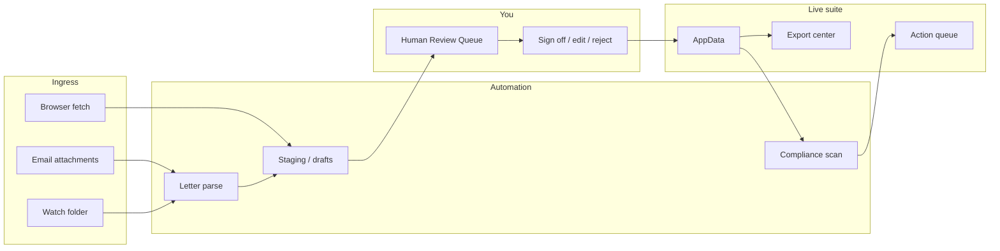

# SUPER WORK FROM HOME MODE — Conceptual Architecture Plan

**Audience:** ACC district-nursing admin staff and product owners — not engineers.  
**Status:** Planning only. No implementation started.  
**Companion docs:** `OPTIMIZATION_PLAN.md` (performance), `PRODUCTION_READINESS.md` (trust & ops).

---

## Vision (one paragraph)

You wake up to a **morning digest**: ACC letters already parsed and filed as drafts, compliance issues grouped by severity, billing rows staged for your review, and portal checks logged where email was not enough. You spend 30–60 minutes **signing off** a human review queue — not doing the repetitive fetch-and-type work. The suite runs overnight (or while you are in meetings) and **never silently commits** anything that leaves the organisation or creates new patients without your explicit approval.

---

## A. What is automatable today vs what still needs you

Mapped to modules already in the ACC Admin Suite.

| Workflow | Today (suite) | Automatable now? | Still needs human |
|----------|---------------|------------------|-------------------|
| **ACC letter filing** | PDF drag-drop → parse → confirm modal (`LetterImportModal`) | **Partial** — text-layer PDFs parse well; OCR for scans; duplicate detection; patient/claim matching | Scanned/low-quality letters; ambiguous name/claim match; new patient creation; any letter below confidence threshold |
| **Compliance monitoring** | Rules engine (`compliance.ts`) + Flagged page with fix shortcuts | **Yes (detect)** — violations, warnings, predictive heads-ups run automatically on data | **Fix decisions** — create approval, request PO, discharge timing, clinical judgement on exceptions |
| **Billing funnel** | Invoice line statuses, remittance aging, dashboard metrics | **Partial** — flag "Awaiting Billing", stale remittance, aging buckets | Entering invoice data, reconciling payments against bank/ACC remittance, disputing declines |
| **Approvals & expiry** | Expiry tracking, NS04/NS05 limits, action queue items | **Yes (detect)** — expired/expiring approvals surface automatically | Renewal requests to ACC, negotiating hours, clinical package changes |
| **Declines** | Status tracking, turnaround metrics | **Partial** — open-decline aging in action queue | Gathering nursing documentation, writing responses, phone follow-up |
| **Complex cases** | Review dates, due/overdue in queue | **Yes (remind)** | Clinical review content, ACC liaison decisions |
| **Export / backup** | Excel workbooks, full ZIP backup (`ExportCenter`) | **Partial** — one-click export when triggered | Choosing what to send to finance; verifying export before email |
| **Dashboard action queue** | `buildActionQueue()` — approvals, billing, declines, coverage gaps, compliance violations | **Yes (prioritise)** — sorts by severity (danger/warn) | Acting on each item — queue tells you *what*, not *how* |

### Already partially there

- **Action queue** on Dashboard — cross-module to-do list with severity and deep links to patient/claim.
- **Letter import confirm modal** — field confidence, blockers vs warnings, duplicate check, explicit Save (auto-commit exists but is risky; production plan says disable it).
- **Compliance rules + fix routing** — e.g. "Create approval" jumps to Approvals with context.
- **Import history** — last 20 letter imports in Settings (audit seed, not full trail).
- **Offline-first** — no network dependency today; good for privacy, bad for email/portal automation until connectors are added.

### Missing for hands-off operation

| Gap | Why it blocks WFH mode |
|-----|------------------------|
| **Email ingest** | Letters arrive in inbox, not as manual PDF picks |
| **Scheduled / background runs** | Nothing runs while the app is closed |
| **Portal access** | Some ACC tasks only exist on web portals (status checks, PO requests) |
| **Human review queue (HRQ)** | No unified "pending your sign-off" inbox — only live action queue + per-file import modal |
| **Batch approve** | One letter at a time through modal |
| **Credential vault** | No safe place for portal passwords outside your head |
| **Notifications** | No morning digest or alert when automation stalls |
| **Audit trail on sign-off** | Cannot prove who approved what and when |

---

## B. The Human Review Queue (HRQ) — product concept

The HRQ is the **centre of SUPER WFH MODE**. It extends today's Dashboard action queue from *"here is what is wrong in your data"* to *"here is what automation prepared for you — approve, edit, or reject."*

### Item types (examples)

| Type | Source | Example |
|------|--------|---------|
| `letter-import-pending` | Email/folder watch → letter pipeline | Parsed approval 87% confidence — PO missing |
| `letter-import-low-confidence` | OCR path | Scanned decline — NHI unclear |
| `letter-duplicate-suspect` | Hash / filename match | Same PDF emailed twice |
| `portal-status-mismatch` | Browser task | Portal shows PO approved; local record still expired |
| `portal-fetch-complete` | Browser task | Remittance list downloaded — ready to merge |
| `billing-anomaly` | Compliance + analytics | Billed hours exceed approval without override note |
| `duplicate-patient-candidate` | Matcher | Two records, same NHI, different spellings |
| `compliance-violation` | Existing engine | NS04 without current approval (already in action queue) |
| `export-ready` | Orchestrator | Weekly billing workbook staged — confirm send to finance |
| `automation-failure` | Orchestrator | IMAP login failed — needs credential refresh |

### Severity and SLA

Reuse the existing **danger / warn** model, plus:

- **SLA clock** — e.g. "letter received 18 h ago, unreviewed" escalates warn → danger.
- **Source tag** — email, folder, portal, manual — so you trust or scrutinise accordingly.
- **Batch actions** — "Approve all 12 high-confidence approval letters from last night" with one confirmation screen listing every patient name.

### Audit trail on sign-off

Every HRQ resolution records: **who** (local user identity when multi-user exists), **when**, **action** (approved / edited / rejected / deferred), **before/after snapshot** for changed fields, **automation run id**. This is a hard dependency from `PRODUCTION_READINESS.md` — without it, overnight automation is not safe.

### How HRQ extends the current Dashboard queue

```
Today:     Data change → buildActionQueue() → read-only list → you navigate and fix manually

SUPER WFH: Ingress → automate → HRQ items (draft state) → you sign off → commit to store → action queue shrinks
```

The existing action queue **stays** for items that are purely analytical (expiring approval with no pending automation). HRQ **adds** a second tab or filter: **"Awaiting my sign-off"** vs **"Already in my data — needs action."**

---

## C. Automation layers

### 1. Email ingress

**Purpose:** ACC letters and correspondence arrive as attachments — stop saving PDFs to Desktop manually.

| Piece | Concept |
|-------|---------|
| Connector | IMAP (generic mailbox) or Microsoft Graph (Office 365) — read-only poll |
| Triage rules | Subject/sender filters → approval vs decline vs ignore; move to "processed" folder |
| Pipeline | Attachment → temp store → existing `letterImport.ts` parse → HRQ item (never direct commit) |
| Failure | Auth failure, oversized attachment, unknown format → HRQ `automation-failure` + email digest line |

**Default rule:** Email path **always** creates an HRQ item. Auto-commit is off in production config (per production readiness P0).

### 2. Browser automation

**When email is enough:** Approval/decline PDFs attached to email — no portal needed.

**When browser is needed:**

- Check claim/PO status on ACC or provider portal when letter is delayed
- Download remittance or approval lists not emailed as PDF
- Submit structured web forms (high risk — always HRQ before submit)

| Option | Fit |
|--------|-----|
| **Playwright (local)** | Full control, runs on your PC or hospital VM; you maintain scripts per portal |
| **Browserbase (cloud)** | Managed browsers, good for scheduled runs; PHI leaves local machine — policy decision |
| **Cursor browser MCP** | Interactive dev/ops tool — good for building and debugging scripts, not overnight production by itself |

**Credential vault pattern:** Portal usernames/passwords stored in **OS keychain** or encrypted local vault (same passphrase model as suite encryption). Automation retrieves at run time. **Never** plaintext in repo, config files, or HRQ item payloads.

### 3. Background worker

Something must run when the React app is closed.

| Option | Pros | Cons |
|--------|------|------|
| **Local daemon** (Node service on admin PC) | PHI stays on device; works offline after fetch | PC must be on; IT may restrict |
| **Cursor Automation / scheduled agent** | Fast to prototype orchestration | Cloud/session model; needs hardening for PHI |
| **Cloud worker** (Browserbase + server) | True "runs while you sleep" | Privacy, DHB policy, credential handling |

**Pragmatic path:** Phase 0–2 local daemon watching a folder + optional email; Phase 3 evaluate cloud only if policy allows.

### 4. Orchestrator

The **brain** that decides what runs when.

| Responsibility | Behaviour |
|----------------|-----------|
| Schedule | e.g. 02:00 — email poll, folder scan, compliance snapshot, portal tasks marked "safe" |
| Ordering | Letters before portal checks (local data must be current) |
| Failure / retry | 3× with backoff; then HRQ failure item + digest notification |
| Idempotency | Same attachment hash → skip or flag duplicate |
| Notification | Morning summary: "14 items ready, 2 failures, 0 overdue SLA" |
| Pause switch | "I'm covering ward today — hold all commits" |

Orchestrator writes **draft records** or **staging area** in IndexedDB — not live `AppData` until HRQ sign-off (or explicit auto-approve rules for low-risk *detection-only* tasks).

---

## D. Security and trust boundaries

Functional rules — not legal advice.

### PHI in motion

- Email and browser sessions contain patient names, NHI, claim numbers.
- Minimise retention: delete temp PDFs after successful sign-off or rejection.
- Browser recordings (if any) must not be stored in cloud without explicit policy.

### What never auto-commits

| Action | Gate |
|--------|------|
| New patient record | **Always human** |
| New claim on existing patient | **Always human** (or HRQ with full field review) |
| Letter import to approvals/declines | HRQ unless 100% confidence **and** production auto-commit explicitly off |
| Excel merge into live data | HRQ or explicit confirm (existing merge modes) |
| Export/email to finance or ACC | **Always human** |
| Portal form submit | **Always human** — automation may fill draft only |
| Delete any record | **Always human** |
| Payment submission / remittance marking paid | **Always human** |

Tie to letter import: `autoCommit` at 100% confidence is convenient in dev but **production readiness ranks it critical risk** — wrong NHI match could file silently. SUPER WFH MODE assumes **HRQ for all letter commits** until audit trail exists.

### Trust zones

```
[Untrusted: email, web portals]
        ↓ parse / fetch only
[Staging / HRQ drafts]
        ↓ explicit sign-off
[Trusted: live AppData + backup]
        ↓ explicit export
[Leaving org: Excel, email, ACC portal submit]
```

---

## E. Phased roadmap

### Phase 0 — Extend existing suite (no email yet)

- **Folder watch** — drop PDFs in `ACC-Inbox/`; daemon or open app scans → HRQ items.
- **HRQ UI** — new "Review" module: pending imports, batch list, sign-off buttons.
- **Disable auto-commit** — all letters through HRQ (production config).
- **Run OPTIMIZATION_PLAN Phase 0** — dashboard usable at 2k patients before queue explodes.
- **Scheduled backup reminder** — from production readiness P0.

*You still open the app daily; automation is "drop folder + review queue."*

### Phase 1 — Email connector + HRQ

- IMAP or Graph connector with triage rules.
- Morning digest (in-app + optional email to you only — no PHI in subject lines).
- Append-only audit log on each sign-off.
- Anonymised real-letter test corpus in CI.

*Letters arrive overnight; you review over coffee.*

### Phase 2 — Browser tasks for specific portals

- One portal scripted end-to-end (e.g. status check only — read, no submit).
- Credential vault integration.
- Portal results → HRQ items, not direct data merge.

*Automation fills in gaps email does not cover.*

### Phase 3 — Overnight batch + morning sign-off

- Full orchestrator schedule (email + folder + portal reads + compliance rescan).
- Batch approve for high-confidence letter batches with mandatory name list confirm.
- SLA escalation on unreviewed items.
- Optional: local daemon runs headless; app opens to digest only.

*Target experience: 90% of **repeatable** work done before you sit down.*

---

## F. What "90% automated" honestly means

"90%" applies to **repeatable admin mechanics**, not the whole job.

| Workflow | Realistic automation share | Notes |
|----------|---------------------------|-------|
| ACC letter filing (PDF email) | **70–85%** | Parse + match + draft; you verify edge cases |
| Scanned / poor OCR letters | **30–50%** | Human retype or correct fields |
| Compliance **detection** | **95%** | Already strong; fixes stay human |
| Billing data entry | **40–60%** | If Excel/remittance import automated; else lower |
| Portal login / status check | **60–80%** | Per portal; breaks when UI changes |
| Portal **submission** | **10–20%** | Keep human — high stakes |
| Phone calls to ACC / families | **0%** | Out of scope |
| Clinical judgement (hours, packages, discharge) | **0–10%** | Suite can nudge, not decide |
| Complex case reviews | **20%** | Reminders only; content is nursing |
| Export to finance | **50%** | Auto-build workbook; you confirm send |

**Blended honest estimate for a district nursing admin week:** roughly **55–70%** of *task volume* can run unattended with Phase 3 — marketing "90%" only if you define the denominator as *"overnight-eligible tasks"* (email letters + compliance scans + reminders), excluding phone, clinical, and submissions.

---

## G. Dependencies on production readiness (must fix first)

SUPER WFH MODE **must not** ship before these gaps are addressed — otherwise background automation amplifies data loss and silent errors.

| Priority | Gap | Why it blocks WFH |
|----------|-----|-------------------|
| P0 | **No silent data loss on corrupt load** | Overnight writes + morning open must not wipe to sample data |
| P0 | **Disable letter auto-commit** | Background parse must not file wrong patient |
| P0 | **Dashboard scale (OPTIMIZATION Phase 0)** | HRQ + action queue together exceed 10k items today |
| P0 | **Save model clarity** | Autosave vs exported file — staff must know what "signed off" persisted |
| P1 | **Audit log on sign-off** | Required for HRQ trust and medico-legal admin trace |
| P1 | **Scheduled backup / export reminder** | Automation increases data churn |
| P1 | **Real-letter OCR regression tests** | Email ingress will feed scans |
| P1 | **CI + stress gates** | Prevent orchestrator regressions |
| P2 | **Multi-user / identity** | "Who signed off" needs an answer |
| P2 | **Roles** | Restrict who can batch-approve exports |

---

## Summary diagram



---

*Concept document — 2026-07-08. Implementation not started. Revisit after PRODUCTION_READINESS P0 and OPTIMIZATION_PLAN Phase 0 are complete.*
